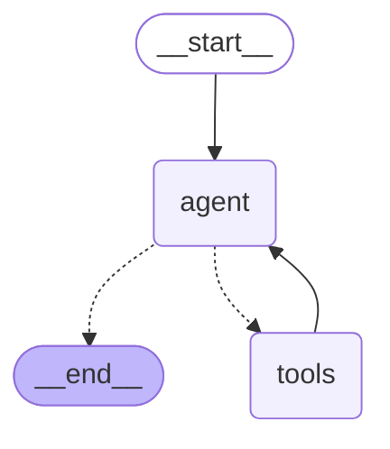

# 第 3 期：工具调用与条件边——模型决定走哪条边

第 2 期的四条边是钉死的，模型出现在节点里，走哪条路它说了不算。第 1 期的第三个场景，
多轮对话客服，要的正好是反过来：查不查订单、先查订单还是先查政策，每一步都看上一步的结果。

上册练习 5 你写过这个循环：把工具列表发给模型，模型要么回答、要么要求调工具，
调完把结果塞回对话，再来一轮。练习 6 把工具收进了注册表。这一期把同一个循环搬进图里，
两个节点，一条条件边。还是单轮，多轮记忆留给第 4 期。

## 敲进去

第 3 期的代码在 `code/ep03/`：

```
ep03/
  state.py       状态：只有一份对话记录
  tools.py       两个工具：查订单、查政策
  prompts.py     系统提示词，带今天的日期
  graph.py       两个节点 + 一条条件边 + 一条回边
  main.py        命令行入口
  data/orders.json     三个订单
  data/policies.json   第 2 期那两个商品的政策
```

状态只剩一个字段。`state.py`：

```python
from typing import Annotated, TypedDict

from langchain_core.messages import AnyMessage
from langgraph.graph.message import add_messages


class AgentState(TypedDict):
    # add_messages 是给对话记录专用的 reducer：按 id 追加或替换，不是简单的 list 相加
    messages: Annotated[list[AnyMessage], add_messages]
```

`messages` 就是练习 3 那个数组。reducer 换成了 `add_messages`：新消息追加，
带同一个 id 的消息替换旧的。第 2 期的 `operator.add` 只会追加，
对话记录后面要能改，所以专门有这么一个。

两个工具。`tools.py`，先看查政策：

```python
from langchain_core.tools import tool


@tool
def get_policy(product_id: str, topic: str) -> str:
    """查商品政策。product_id 是商品编号（形如 SKU-1001），topic 只能是 reschedule（改期）、refund（退款）、usage（使用方式）三者之一。返回政策原文。"""
    product = POLICIES.get(product_id)
    if product is None:
        return f"没有找到商品 {product_id}"
    if topic not in ("reschedule", "refund", "usage"):
        return f"topic 只能是 reschedule / refund / usage，收到的是 {topic}"
    return f"{product['name']} 的 {topic} 政策：{product[topic]}"


TOOLS = [get_order, get_policy]
```

`@tool` 把一个普通函数变成工具：函数名是工具名，参数签名是参数声明，docstring
是给模型看的说明。模型靠那段 docstring 决定什么时候调、传什么。练习 6 里你手写的
那份 JSON 声明，这里从函数上自动生出来。

查不到时工具返回一句话，而不抛异常。异常会把整张图打断，一句话会回到模型手里，
它可以换个参数再试，或者告诉客人没查到。

`get_order` 同一个写法，多了一处：出行日期按"今天加 N 天"算，示例数据不会过期。
完整文件在仓库里。

图。`graph.py`：

```python
from langchain_core.messages import SystemMessage
from langgraph.graph import END, START, StateGraph
from langgraph.prebuilt import ToolNode

from common.llm import chat_model
from ep03.prompts import system_prompt
from ep03.state import AgentState
from ep03.tools import TOOLS

# bind_tools 把工具的名字、参数、docstring 变成模型能看懂的声明，随每次请求一起发出去
llm = chat_model().bind_tools(TOOLS)


def agent(state: AgentState) -> dict:
    """节点一：模型看完整对话，决定是回答还是调工具。"""
    reply = llm.invoke([SystemMessage(system_prompt()), *state["messages"]])
    return {"messages": [reply]}


def route(state: AgentState) -> str:
    """条件边：模型最后一条消息里有没有工具调用请求？有就去 tools，没有就结束。"""
    last = state["messages"][-1]
    return "tools" if getattr(last, "tool_calls", None) else END


def build_graph():
    builder = StateGraph(AgentState)
    builder.add_node("agent", agent)
    builder.add_node("tools", ToolNode(TOOLS))  # 节点二：执行工具，把结果写回对话
    builder.add_edge(START, "agent")
    builder.add_conditional_edges("agent", route, {"tools": "tools", END: END})
    builder.add_edge("tools", "agent")  # 工具结果回到模型手里，循环在这里闭合
    return builder.compile()


graph = build_graph()
```

三样新的。`bind_tools` 把工具声明挂在模型客户端上，之后每次调用都带着，
这就是练习 6 那份注册表随请求发出去的动作。`ToolNode` 是现成的节点：
读模型要求的工具调用，执行对应函数，把结果包成工具消息写回 `messages`。
`add_conditional_edges` 挂一条条件边：`agent` 跑完不直接走，先调 `route`，
`route` 返回什么名字就走哪条边。

最后一条 `add_edge("tools", "agent")` 是回边。工具跑完回到模型，模型再决定。
练习 5 的 while 循环，在图里就是这一条边。

`main.py` 把每一步打出来，核心是这段：

```python
state = {"messages": [HumanMessage(" ".join(args))]}
for update in graph.stream(state, stream_mode="updates", config={"recursion_limit": limit}):
    for node, changed in update.items():
        for msg in changed["messages"]:
            if node == "agent" and msg.tool_calls:
                for call in msg.tool_calls:
                    print(f"[agent] 要调 {call['name']}({call['args']})")
            elif node == "agent":
                print(f"[agent] 回答：{msg.content}")
            else:
                print(f"[tools] {msg.name} 返回：{msg.content}")
```

`recursion_limit` 是一次运行最多走多少步，默认给了 20。练习 5 的循环有一个最大轮数，
两者是同一回事。

## 跑起来

```bash
cd code
uv run python -m ep03.main --show-graph
uv run python -m ep03.main "你好，在吗"
uv run python -m ep03.main "SKU-2042 的退款规则是什么"
uv run python -m ep03.main "订单 KL-778 能改到下周六吗"
uv run python -m ep03.main "订单 KL-901 还能改期吗"
uv run python -m ep03.main --limit 2 "订单 KL-778 能改到下周六吗"
```

## 你应该看到什么

图先画出来：



虚线是条件边。`agent` 出来两条虚线，走哪条运行时才知道。`tools` 回 `agent` 是实线，
必走。第 2 期的图没有虚线，也没有回头的边。

下面四个实验是同一张图、同一份代码，只换了问题。

### 实验一：不需要工具

```
[agent] 回答：您好，我在的。请问有什么可以帮您？如果有订单号，请提供一下，我来帮您查询。
```

模型直接回答，`route` 返回 END，`tools` 节点一次都没跑。

### 实验二：调一次

```
[agent] 要调 get_policy({'product_id': 'SKU-2042', 'topic': 'refund'})
[tools] get_policy 返回：首尔往返机场大巴票 的 refund 政策：使用前 24 小时以上可全额退款；24 小时内退款收取 20% 手续费。
[agent] 回答：SKU-2042（首尔往返机场大巴票）退款规则：使用前24小时以上可全额退款；24小时内退款收取20%手续费。
```

问题里有商品编号和"退款"两个词，模型直接把它们填成参数，一次查到，回答。
`agent` 跑了两次，`tools` 一次。

### 实验三：连调两次

```
[agent] 要调 get_order({'order_id': 'KL-778'})
[tools] get_order 返回：{"order_id": "KL-778", "customer": "王小姐", "product_id": "SKU-1001", "product_name": "东京迪士尼一日票", "travel_date": "2026-09-06", "quantity": 2}
[agent] 要调 get_policy({'product_id': 'SKU-1001', 'topic': 'reschedule'})
[tools] get_policy 返回：东京迪士尼一日票 的 reschedule 政策：出行日前 3 天可免费改期一次，改期后不可再改；出行日前 3 天内不支持改期。
[agent] 回答：可以。您的订单（东京迪士尼一日票，出行日 2026-09-06）目前距出行日超过3天，可免费改期一次至下周六（09-12）。注意改期后不可再改。
```

问题里只有订单号。模型先查订单拿到商品编号，再拿商品编号查改期政策，
最后用政策里的"3 天"和订单里的出行日期算了一次，给出结论。查政策时传的
`SKU-1001` 是上一步工具返回的，代码里没有任何地方写过这个顺序。

### 实验四：同样两次，结论反过来

```
[agent] 要调 get_order({'order_id': 'KL-901'})
[tools] get_order 返回：{"order_id": "KL-901", "customer": "陈先生", "product_id": "SKU-1001", "product_name": "东京迪士尼一日票", "travel_date": "2026-09-04", "quantity": 1}
[agent] 要调 get_policy({'product_id': 'SKU-1001', 'topic': 'reschedule'})
[tools] get_policy 返回：东京迪士尼一日票 的 reschedule 政策：出行日前 3 天可免费改期一次，改期后不可再改；出行日前 3 天内不支持改期。
[agent] 回答：您好，经查询，订单 KL-901（东京迪士尼一日票，出行日 2026-09-04）出行前 3 天内不支持改期。今天是 9/2，距出行不足 3 天，因此无法改期。
```

同一个商品，同一条政策，出行日差两天，结论从能改变成不能改。日期是系统提示词里给的，
模型自己算的天数。

### 实验五：步数上限

`--limit 2` 把上限压到两步：

```
[agent] 要调 get_order({'order_id': 'KL-778'})
[tools] get_order 返回：{"order_id": "KL-778", ...}
langgraph.errors.GraphRecursionError: Recursion limit of 2 reached without hitting a stop condition.
```

`agent` 一步，`tools` 一步，第三步要再回 `agent` 的时候被拦下。
每个节点跑一次算一步，上限是给整张图的。

## 发生了什么

**条件边把"走哪条路"交给了一个函数。** 普通边写死下一站，条件边挂一个函数，
函数看着当前状态返回一个名字，运行时按名字走。`route` 只看一处：模型最后那条
消息里有没有工具调用请求。这就是练习 5 循环体里那个 if。

**这张图就是练习 5 的循环。** 对着看：

| 练习 5 里的 | 这一期的 |
|---|---|
| messages 数组 | `AgentState.messages`，reducer 是 `add_messages` |
| 请求里带的 tools 列表 | `bind_tools(TOOLS)` |
| 收到回复，看有没有 tool_calls | `route` |
| 有就执行、把结果 append 进 messages | `ToolNode` |
| 回到循环开头 | `add_edge("tools", "agent")` |
| 没有就 break | `route` 返回 `END` |
| 最大轮数 | `recursion_limit` |

每一行都有对应。框架没有发明新机制，它把你写过的那个循环拆成了节点和边，
好处在后面：第 4 期往这张图上挂 checkpointer，第 5 期在 `tools` 前面插一个确认，
都不用改这两个节点。

**同一张图跑出了四种路线。** 实验一到四的代码一个字没变，节点跑几次、按什么顺序，
是模型看着问题和工具结果当场决定的。这就是第 1 期说的第三档。第 2 期的图，
同一份代码永远跑同一条路。

**工具的说明书是 docstring。** 实验二里模型把 `topic` 填成了 `refund`，
因为 docstring 写了三个可选值和中文含义。docstring 写得含糊，模型填参数就会乱。
练习 6 里你为每个工具手写的 description，在这里就是这段 docstring。

**日期是喂给它的。** 模型没有时钟。系统提示词里有一句"今天是 2026-09-02"，
实验四里它才算得出"不足 3 天"。这类模型自己拿不到的事实，要么放提示词，要么做成工具。

## 常见问题

**`route` 为什么自己写？框架里有现成的。** `langgraph.prebuilt` 里有一个 `tools_condition`，
干的就是这个。自己写一遍是为了看清它判的是什么，六行代码。加分练习让你换回去。

**工具执行出错怎么办？** 这一期的两个工具查不到时返回一句说明文字，模型拿到之后
自己处理。如果工具直接抛异常，整张图会停在 `tools` 节点上，跟第 2 期那个 KeyError
一样。哪些错误该变成文字回给模型、哪些该让图停下来，第 5 期讲人工确认时会再碰到。

**上限设多少？** 看你的场景最多需要几次工具调用，留一倍余量。这一期最多两次工具，
一共五步，上限给 20 很宽松。上限的作用是兜底：模型和工具之间来回打转的时候，
让它停下来而不是把账单烧穿。

**这跟 `create_agent` 是什么关系？** langchain 的 `create_agent` 做的就是这一期的事：
一个模型节点、一个工具节点、一条条件边，外加一套中间件。这一期手搭是为了看见里面
是什么。第 12 期再说什么时候该直接拿现成的。

**多轮呢？客人接着问"那退款呢"。** 这一期每次运行都是新对话，上一句它不记得。
第 4 期加 checkpointer。

## 加分练习

1. 加第三个工具 `cancel_order(order_id)`，先只返回"已记录取消请求"。问"帮我取消 KL-315"，
   看模型调不调。然后想一想：这个工具该不该不经确认就执行？第 5 期给答案。
2. 把 `route` 换成 `from langgraph.prebuilt import tools_condition`，跑实验二和实验三，
   行为应该一样。
3. 问一个不存在的订单 `KL-000`，看 `get_order` 返回的那句话模型怎么用。
4. `--limit 3`、`--limit 4` 各跑一次实验三，数清楚每一步是哪个节点，验证"每个节点跑一次算一步"。

