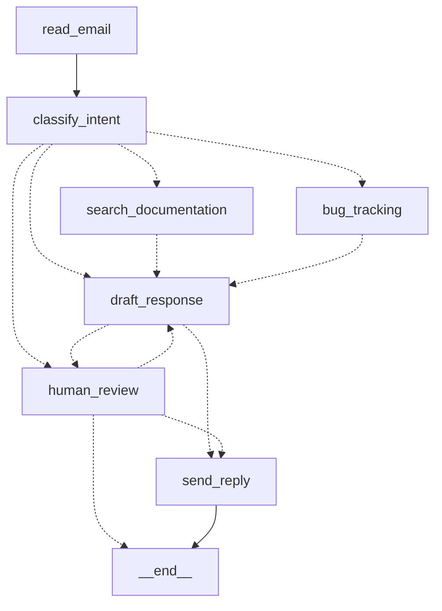

# 客服邮件分流——把业务流程想成图

> 重做的是 LangGraph 官方文档里的 "Thinking in LangGraph" 那个客服邮件 agent。
> 用到的机制：第 2 期（节点与边）、第 4 期（checkpointer 与 thread_id）、第 5 期（interrupt）。

第 1 期说企业里大多数需求的正确答案是第二档：流程画得出来，就写成代码，模型只在
几个节点里填空。Part 3 的第一个例子就是一条画得出来的流程——客服邮箱进来一封邮件，
判断它是哪类，按类别去查文档、建工单或者转人工，拟一份回复，紧急的先给人过一眼，
不紧急的直接发。官方拿这个例子教"怎么把一个业务流程想成一张图"，这一篇照着它的
方法重做一遍，用锁定的 1.x 版本，全部真机跑过；官方例子里有一处照抄会发出空邮件，
也一起说。

## 想成图：五步

官方给的方法是五步，值得先记住再看代码：

1. **把流程拆成离散的步骤**，每一步是一个节点，画出它们之间的连线。
2. **给每一步定性**：调模型、取数据、做动作、还是等人。定性决定这个节点该怎么写、
   出错了怎么办。
3. **设计共享状态**：每个节点要读什么、写什么。原则是"存原始数据，不存拼好的文本"。
4. **写节点函数**，每个节点自己处理自己那类错误。
5. **接起来**，配上 checkpointer。

这封邮件的流程拆出来是七个节点：



按第二步定性：`classify_intent` 和 `draft_response` 调模型；`read_email`、
`search_documentation`、`bug_tracking`、`send_reply` 是数据和动作，纯代码；
`human_review` 等人。七个节点，模型只出现在两个里。

## 敲进去

代码在 `code/ex01_email_triage/`，五个文件加两份假数据。

### 状态：存原始数据

```python
class EmailClassification(TypedDict):
    intent: Literal["question", "bug", "billing", "feature", "complex"]
    urgency: Literal["low", "medium", "high", "critical"]
    topic: str
    summary: str


class EmailState(TypedDict, total=False):
    email_id: str
    sender: str
    subject: str
    body: str
    classification: EmailClassification
    search_results: list[str]
    ticket_id: str
    draft: str
    review: str
    sent: bool
    trace: Annotated[list[str], operator.add]
```

分类结果是四个字段，检索结果是一个列表，工单是一个 id。没有任何一个字段是"给
模型看的那段话"——那段话在 `draft_response` 里现拼。官方原文："Your state should
store raw data, not formatted text. Format prompts inside nodes when you need them."
好处有两个：不同节点可以把同一份数据拼成不同样子；调试时看 state 一眼能对出每个
字段是谁写的、对不对。

### 路由写在节点里

```python
def classify_intent(state: EmailState) -> Command[Literal["human_review", "search_documentation", "bug_tracking", "draft_response"]]:
    result = _validate(classifier.invoke(
        CLASSIFY.format(sender=state["sender"], subject=state["subject"], body=state["body"])
    ))
    intent, urgency = result["intent"], result["urgency"]
    if intent == "billing" or urgency == "critical" or intent == "complex":
        goto = "human_review"
    elif intent in ("question", "feature"):
        goto = "search_documentation"
    elif intent == "bug":
        goto = "bug_tracking"
    else:
        goto = "draft_response"
    return Command(update={"classification": result, "trace": [...]}, goto=goto)
```

前面 15 期分叉都用 `add_conditional_edges`：节点只改状态，另写一个路由函数决定
下一步。这里换成节点直接返回 `Command(update=..., goto=...)`——一个函数既说"我改
了什么"也说"下一步去哪"，返回类型里的 `Literal[...]` 列出所有可能去的地方，图能
据此画出虚线。`build_graph` 里因此只剩三条实线边：`START → read_email`、
`read_email → classify_intent`、`send_reply → END`，其余全在节点里。

两种写法都对。分叉多、判断只依赖这个节点自己刚算出来的结果时，写在节点里读起来
顺；路由逻辑要被好几个节点复用、或者想让图的结构一眼可见时，条件边更合适。

注意路由规则本身是那四行 `if`：模型只给出 `intent` 和 `urgency` 两个标签，"什么
标签走哪条路"是代码。改规则不用碰提示词。

### 结构化输出：三种协议试到第三种

分类节点要模型按 `EmailClassification` 的结构吐字段。langchain 的
`with_structured_output()` 底下有三种协议，这台端点（DeepSeek）真机试下来两种走不通：

| method | 底下发的是什么 | DeepSeek 的反应 |
|---|---|---|
| `json_schema`（默认） | OpenAI 自家的 `response_format: json_schema` | 400 `This response_format type is unavailable now` |
| `function_calling` | 把结构当成一个工具，`tool_choice` 强制调它 | 400 `Thinking mode does not support this tool_choice` |
| `json_mode` | `response_format: json_object`，只保证返回合法 JSON | 通 |

第三种不保证字段取值合法，所以配一个 `_validate`：`intent` 不在五个值里归
`complex`，`urgency` 不在四个值里归 `high`——拿不准一律往"要人看"的方向归，
错也错在保守那边。换端点要重新试一遍这三种；前面 15 期用的工具调用能在这个模型
上通，是因为那里没有强制 `tool_choice`。

### 瞬时错误交给 RetryPolicy

```python
builder.add_node("search_documentation", search_documentation,
                 retry_policy=RetryPolicy(max_attempts=3, initial_interval=0.2, retry_on=tools.TransientError))
```

文档库超时这类"再试一次就好"的错误，官方的分类里叫 transient，处理方式是挂在
节点上的重试策略，不写进节点逻辑。`retry_on` 限定只对 `TransientError` 重试——
别的异常照常抛出来，免得把一个真 bug 重试三遍再报。官方把错误分四类：瞬时的
（重试）、模型能自己纠正的（把错误写进 state 回到模型节点）、要人修的（interrupt）、
意料之外的（让它冒出来）。这一篇用到前面两类之外的两类。

### 人工审核：官方例子的一个坑

```python
def human_review(state: EmailState) -> Command[Literal["send_reply", "draft_response", "__end__"]]:
    decision = interrupt({...})
    if decision == "approve":
        if not state.get("draft"):
            return Command(update={...}, goto="draft_response")
        return Command(update={...}, goto="send_reply")
    if isinstance(decision, str) and decision.startswith("edit:"):
        return Command(update={"review": "edit", "draft": decision[5:].strip(), ...}, goto="send_reply")
    return Command(update={"review": "reject", ...}, goto=END)
```

`interrupt()` 是这个节点的第一行——第 5 期讲过，恢复时整个节点从头重跑，它前面
的代码会执行两遍。

多出来的 `draft_response` 那条去向是这一篇加的。官方例子里 `human_review` 批准
就去 `send_reply`。但 `billing` 和 `complex` 两类邮件是在**分类阶段**就转人工的，
这时 `draft_response` 还没跑过，state 里没有草稿；照抄的话，人工点一下批准，
`send_reply` 会把 `None` 当正文发出去。所以没有草稿的批准先去拟稿，拟完按紧急
程度它会回到 `human_review` 再审一次——高紧急的邮件人工看两眼，一次看分类对
不对，一次看草稿能不能发。

## 跑起来

```bash
cd code
uv run python -m ex01_email_triage.main --all              # 五封假邮件各走一遍
uv run python -m ex01_email_triage.main --resume M-102 approve
uv run python -m ex01_email_triage.main --resume M-105 reject
uv run python -m ex01_email_triage.main --resume M-103 "edit:改好的全文"
FLAKY_DOCS=1 uv run python -m ex01_email_triage.main M-101   # 给文档库注入一半概率的超时
```

`thread_id` 就是邮件 id：一封邮件一条线。checkpointer 是 SQLite 文件，停在人工
审核的邮件换个进程、换一天，用同一个 id `--resume` 接着走。

## 你应该看到什么

### 五封邮件，四条路

```
=== M-101：东京迪士尼门票能改期吗 ===
  classify -> question/low -> search_documentation
  search_docs -> 1 条
  draft -> send_reply
  send_reply -> 已发

=== M-102：付款成功但一直没收到电子凭证 ===
  classify -> bug/high -> bug_tracking
  create_ticket -> BUG-2F6436
  draft -> human_review
[等待人工审核] 邮件 M-102 来自 chen@example.com｜付款成功但一直没收到电子凭证
  分类：bug / high｜客人昨天购买首尔机场大巴票，付款成功但邮箱和App均无凭证……明天早上要用票
  草稿：您好，关于您付款成功但未收到电子凭证的问题，我们已建立工单 BUG-2F6436，会尽快跟进处理……

=== M-103：被重复扣款了两次 ===
  classify -> billing/high -> human_review
[等待人工审核] 邮件 M-103 来自 li@example.com｜被重复扣款了两次
  草稿：(分类阶段直接转人工，还没有草稿)

=== M-104：建议：能不能加一个多人订单批量改期 ===
  classify -> feature/low -> search_documentation
  search_docs -> 2 条
  draft -> send_reply
  send_reply -> 已发

=== M-105：几个问题一起问 ===
  classify -> complex/high -> human_review
```

问用法的和提建议的查完文档直接发了；报故障的建了工单、因为客人明天要坐车被判
`high`、草稿拟好停下来等人；重复扣款的和一封里问三件的，分类完就转人工，连草稿
都没拟。M-104 的回复里除了"批量改期在规划中"，还顺带提了团体票 9 折——因为
`search_docs` 用分类出来的 `topic` 和 `summary` 去搜，命中了两条文档，两条都进了
拟稿的上下文。

### 三种审核决定，三个进程

```
$ uv run python -m ex01_email_triage.main --resume M-102 "edit:您好，凭证已为您手动重发到下单邮箱……"
  human_review -> edit
  send_reply -> 已发
  已回复 chen@example.com：您好，凭证已为您手动重发到下单邮箱，请查收（含垃圾邮件文件夹）……

$ uv run python -m ex01_email_triage.main --resume M-103 approve
  human_review -> approve（无草稿，先拟稿）
  draft -> human_review
[等待人工审核] 邮件 M-103 来自 li@example.com｜被重复扣款了两次
  草稿：您好，已收到您关于大巴票被重复扣款的反馈。我们非常理解您的急迫心情，会立即为您加急核实这笔交易……

$ uv run python -m ex01_email_triage.main --resume M-103 approve
  human_review -> approve
  send_reply -> 已发

$ uv run python -m ex01_email_triage.main --resume M-105 reject
  human_review -> reject
  人工拒绝，不回复。
```

M-103 那两次批准就是上面说的那条补出来的路：第一次批准时没有草稿，图先去拟稿，
拟完因为 `high` 又回到人工审核，第二次批准才发出去。三个进程之间没有任何内存
共享，靠的是 SQLite 里那个 `thread_id` 对应的 checkpoint。

### 重试：注入一半概率的超时，跑三次

```
-- run 1
  [search_docs] 文档库超时（FLAKY_DOCS 注入），抛 TransientError
  [search_docs] 文档库超时（FLAKY_DOCS 注入），抛 TransientError
  [search_docs] 文档库超时（FLAKY_DOCS 注入），抛 TransientError
ex01_email_triage.tools.TransientError: 文档库超时（FLAKY_DOCS 注入）
-- run 2
  [search_docs] 文档库超时（FLAKY_DOCS 注入），抛 TransientError
  search_docs -> 1 条
  draft -> send_reply
-- run 3
  search_docs -> 1 条
  draft -> send_reply
```

第二次跑失败一次、第二次尝试成功，节点后面的流程照常——这是 `RetryPolicy` 在
干活，节点代码里没有一行 try。第一次跑三次都失败（一半概率连中三次，八分之一），
`max_attempts=3` 用完，异常原样冒出来，进程退出——这也是设计：重试解决的是瞬时
错误，三次还失败就当它是真故障，让人看见，别再假装正常。checkpoint 停在
`classify_intent` 之后，文档库恢复了用同一个 id 再跑就从那里继续。

## 发生了什么

**这张图里模型没有选择权。** 七个节点里模型出现两次，每次的任务都是填空：一次
填四个分类字段，一次填一段回复。走哪条路、要不要建工单、发不发之前要不要人看，
全是代码按标签判的。这跟第 3 期之后那个客服 agent 是两种东西：那边模型决定调
哪个工具、调几轮；这边模型连"下一步"这个概念都没有。第 1 期四问清单里落在"流程
加条件分支"那一档的需求，就该长这样。

**路由的判断依据来自模型，路由本身是代码。** `classify_intent` 里模型输出
`intent` 和 `urgency`，`if` 语句决定去向。想改"billing 也先拟稿再转人工"，改一行
`if`；想改分类的粒度，改提示词和 `Literal` 的取值。两件事分开，各改各的。

**结构化输出不是一个开关，是三种协议。** `with_structured_output()` 一行调用，
底下可能发出三种完全不同的请求，端点支持哪种要试。这一篇用 DeepSeek 试出两个
400 才落到 `json_mode`；换成别的端点，答案可能不同。`_validate` 那几行兜底
因此不能省——`json_mode` 保证的只是"是 JSON"，不保证字段合法。

**checkpointer 让"等人"这一步可以等很久。** `thread_id` 用邮件 id，审核的人
可以第二天再决定，进程早就退出了也没关系。这跟第 12 期 FastAPI 服务里的
`/chat/resume` 是同一个机制，只是这里没有 HTTP 一层。

**照着官方例子写也要跑一遍。** 空草稿那条路官方文档没提，读代码看不出来，真机
跑 `M-103` 点批准才撞见。文档教的是方法，例子里的边界条件是你自己的。

## 常见问题

**为什么不让模型直接决定去哪个节点？** 可以做到（让模型输出 `goto`），但没有理由：
四条路的判断标准是明确的业务规则，写成 `if` 可测、可改、出错能定位到行。模型该做
的是它擅长的部分——从一段自由文本里读出类别和紧急程度。

**`Command(goto=...)` 和 `add_conditional_edges` 能混用吗？** 能，这一篇就混了：
`START → read_email → classify_intent` 和 `send_reply → END` 是普通边，其余是
`Command`。同一个节点不要两种都用，会打架。

**分类错了怎么办？** 五封假邮件这次全对，真实邮件不会全对。两道保险：分错成
`complex`/`critical` 的会走到人工；分错成 `question` 的会查文档、拟稿、直接发——
这条路上没有人。要收紧，把 `draft_response` 的规则改成"`medium` 以上也先给人看"，
代价是人工量。这个取舍是业务决定，代码只是把它变成一行。

**RetryPolicy 会重试模型调用吗？** 这一篇只挂在 `search_documentation` 上。模型
端点的 429/超时也是瞬时错误，可以给两个模型节点也挂一个，`retry_on` 换成端点
抛的异常类型。没挂是因为这一篇没遇到。

**假数据太少了吧？** 五封，每条路至少走一次。Part 3 每个例子都是"假数据下端到端
能跑"，读者换成自己的邮件样本时，第 15 期的评测方法就该接上来了。

## 加分练习

1. 给两个模型节点也挂 `RetryPolicy`，`retry_on` 换成 `openai.RateLimitError` 和
   `openai.APITimeoutError`，用一个假端点验证它真的重试了。
2. 把 `human_review` 的三个决定加一个 `reply_directly:<正文>`：人工直接写回复
   不经过模型，看要改哪几行。
3. 用第 15 期的 `runner.py` 给这张图写五条用例：每封假邮件断言 `classify` 的
   去向，再加一条 `billing` 的 rubric "回复里不能承诺具体退款时间"。
4. 把 `EMAILS` 换成真的 IMAP 拉取（`imaplib` 标准库就够），`send_email` 换成
   SMTP，只改 `tools.py` 和 `read_email`，图一行不动——验证"改场景改哪里"那份
   说明是不是成立。
