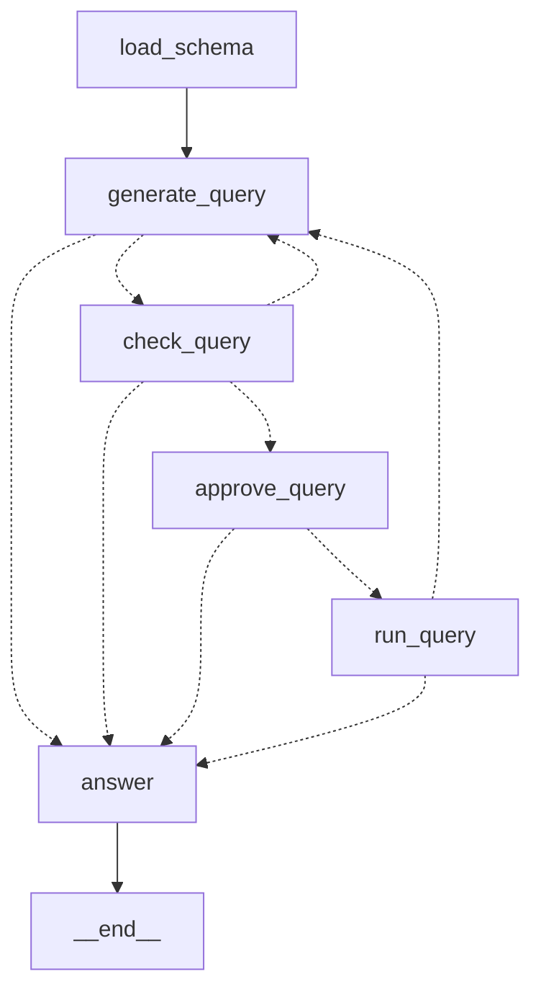

# SQL 问数——执行前停下来批准

> 重做的是 LangGraph 官方教程 "Build a custom SQL agent"：对着 Chinook 示例库（一家数字
> 音乐商店：艺术家、专辑、曲目、客户、发票，11 张表）用自然语言问数。
> 用到的机制：第 2 期（节点与边）、第 5 期（interrupt）、例子 1 的 `Command` 路由和 json_mode。

"用自然语言查数据库"大概是企业里被提得最多的 agent 需求。官方教程的做法是让模型
拿着"查表名、查结构、跑 SQL"三个工具自己转，中间强制它调两次工具，再让它复查一遍自己
写的 SQL。这一篇换一种写法：模型只出现两次，一次把问题写成 SQL，一次把结果说成人话；
SQL 对不对交给数据库自己判，跑不跑交给人批。写法换掉有一个现实原因，先说。

## 官方那张图，和这一篇的

官方六个节点：`list_tables`（代码）→ `call_get_schema`（模型，`tool_choice="any"` 强制它
调 `get_schema`）→ `get_schema`（ToolNode）→ `generate_query`（模型，绑着 `run_query` 工具）
→ `check_query`（模型，再强制调一次工具，提示词是"检查下面八种常见错误，有就重写"）→
`run_query`（ToolNode）→ 回到 `generate_query`。人工批准是把 `run_query` 工具包一层
`interrupt()`。

例子 1 真机撞见过：DeepSeek 的思考模式拒绝强制 `tool_choice`，400 "Thinking mode does not
support this tool_choice"。官方图里两处强制调用在这台端点上跑不起来。绕过去的办法有，
但顺着这个约束重新看那张图，会发现三处模型调用里有两处本来就用不上模型：

- 选表、拿结构：Chinook 全库 11 张表的建表语句加起来两千来个字符，直接整份给模型，
  比"让模型先决定看哪几张表"少一次调用、少一个出错点。
- 复查 SQL：语法错、表名列名不存在，数据库自己一句 `EXPLAIN QUERY PLAN` 就能报出来，
  不用另一个模型凭"八种常见错误"的清单去猜。

于是这一篇的图：



没有 ToolNode。模型不"调工具"，SQL 是它按结构吐出来的一个字段，存在 state 里。

## 敲进去

代码在 `code/ex02_sql_agent/`：`db.py` 是数据库这一侧的全部代码（下载、读结构、校验、
只读执行，没有一行调模型），`graph.py` 是六个节点。

### 生成：SQL 是一个字段，可以为空

```python
generator = llm.with_structured_output(
    {"title": "Query", "type": "object",
     "properties": {"sql": {"type": ["string", "null"]}, "reason": {"type": "string"}},
     "required": ["sql", "reason"]},
    method="json_mode",
)


def generate_query(state: SqlState) -> Command[Literal["check_query", "answer"]]:
    feedback = ""
    if state.get("check_error"):
        feedback = f"\n上一版 SQL 没有通过校验，原因：{state['check_error']}。请改正后重写。"
    elif state.get("run_error"):
        feedback = f"\n上一版 SQL 执行报错：{state['run_error']}。请改正后重写。"
    out = generator.invoke(GENERATE.format(schema=state["schema"], question=state["question"], feedback=feedback))
    sql, reason = out.get("sql"), str(out.get("reason", ""))
    attempts = state.get("attempts", 0) + 1
    if not sql:
        return Command(update={..., "trace": [f"generate #{attempts} -> 模型判断查不了：{reason}"]}, goto="answer")
    return Command(update={...}, goto="check_query")
```

`sql` 允许是 `null`：提示词明说"问题里的概念在表里找不到对应字段，就不要硬编"。模型
判断查不了，图直接去解释，不会带着一条编出来的 SQL 往下走。`feedback` 那两行是改错
循环的入口——校验或执行失败的原因写在 state 里，下一次生成时拼进提示词。

### 校验：规则加数据库，都是代码

```python
def check_query(sql: str) -> None:
    s = sql.strip().rstrip(";").strip()
    if ";" in s:
        raise QueryRejected("只允许一条语句，不能用分号拼接")
    if not s.upper().startswith(("SELECT", "WITH")):
        raise QueryRejected("只允许 SELECT 查询，这条语句以 %s 开头" % s.split()[0].upper())
    with connect() as conn:
        try:
            conn.execute(f"EXPLAIN QUERY PLAN {s}")
        except sqlite3.Error as e:
            raise QueryRejected(f"数据库校验没过：{e}") from e
```

第一道是业务规则：只放行单条 `SELECT`/`WITH`。第二道让数据库做：`EXPLAIN QUERY PLAN`
只做解析和规划，不执行，语法错、不存在的表名列名都会在这一步报出来。没过的原因原样回给
模型，改了三次还没过就放弃、去解释。

### 批准：interrupt 放第一行，人改过的也要校验

```python
def approve_query(state: SqlState) -> Command[Literal["run_query", "answer"]]:
    decision = interrupt({"question": ..., "sql": state["sql"], "reason": state["reason"],
                          "options": ["accept", "edit:<改好的 SQL>", "reject"]})
    if decision == "accept":
        return Command(update={"approval": "accept", ...}, goto="run_query")
    if isinstance(decision, str) and decision.startswith("edit:"):
        new_sql = decision[5:].strip()
        try:
            db.check_query(new_sql)
        except db.QueryRejected as e:
            return Command(update={"sql": None, "reason": f"人工改写的 SQL 没通过校验：{e}", ...}, goto="answer")
        return Command(update={"approval": "edit", "sql": new_sql, ...}, goto="run_query")
    return Command(update={"approval": "reject", "sql": None, ...}, goto="answer")
```

给人看的是 SQL 和模型的一句说明，批的是"这条查询可以在库上跑"。人改写的 SQL 走同一道
校验——人也会写错，也会手滑写出 `DELETE`。

### 只读连接：最后一道保证在数据库层

```python
def connect() -> sqlite3.Connection:
    return sqlite3.connect(f"file:{ensure_db()}?mode=ro", uri=True)
```

提示词说了只写 `SELECT`，校验拦了非 `SELECT`，人还看了一眼——三道之后再加一道：连接
本身只读。前三道任何一道漏了，这一道兜住，而且它跟模型、跟校验代码、跟人都无关。

## 跑起来

```bash
cd code
uv run python -m ex02_sql_agent.main --thread q1 "哪个国家的客户最多？"   # 停在批准
uv run python -m ex02_sql_agent.main --resume q1 accept
uv run python -m ex02_sql_agent.main --resume q2 "edit:SELECT ... LIMIT 3"
uv run python -m ex02_sql_agent.main --resume q7 reject
```

第一次运行会从官方教程用的同一个地址下载 Chinook.db（约 900KB）。checkpointer 是
SQLite 文件，批准可以在另一个进程、另一天做。

## 你应该看到什么

### 一问一批一答

```
=== 哪个国家的客户最多？  (thread=q1) ===
  load_schema -> 11 张表
  generate #1 -> SELECT Country FROM Customer GROUP BY Country ORDER BY COUNT(*) DESC LIMIT 1;
  check -> 通过
[等待批准] thread=q1
  SQL：SELECT Country FROM Customer GROUP BY Country ORDER BY COUNT(*) DESC LIMIT 1;
  说明：客户表有 Country 字段，按国家分组计数并降序取第一即可。

$ uv run python -m ex02_sql_agent.main --resume q1 accept
  approve -> accept
  run -> 1 行
回答：客户最多的国家是 **美国**。
```

官方教程那道题也问了一遍——"平均曲目时长最长的是哪个音乐类型？"——模型写的是
`SELECT g.Name FROM Track t JOIN Genre g ... ORDER BY AVG(t.Milliseconds) DESC LIMIT 1`，
批准后回答 **Sci Fi & Fantasy**，跟官方文档里的结果一致。

### 人改 SQL：问题没改，模型如实说

```
[等待批准] thread=q2
  SQL：SELECT Artist.Name, SUM(InvoiceLine.UnitPrice * InvoiceLine.Quantity) AS total_sales
       FROM Artist JOIN Album ... JOIN InvoiceLine ... GROUP BY Artist.ArtistId, Artist.Name
       ORDER BY total_sales DESC LIMIT 5;

$ uv run python -m ex02_sql_agent.main --resume q2 "edit:SELECT ... LIMIT 3"
  approve -> edit
  run -> 3 行
回答：销售额最高的前 3 位艺术家是：
1. Iron Maiden – 138.6
2. U2 – 105.93
3. Metallica – 90.09
查询结果中没有第 4、5 位的数据，因此无法列出前 5 位。
```

问题问的是前 5，人把 `LIMIT` 改成 3，回答那一步的模型看到的是原问题加三行结果，它把
这个不一致说出来了——`ANSWER` 提示词里那句"只根据查询结果说话"在起作用。

### 模型自己判断查不了

```
=== 按客户的会员等级统计各等级的人数  (thread=q4) ===
  generate #1 -> 模型判断查不了：表结构中缺少客户的会员等级字段，无法按会员等级统计人数。
回答：查不了。原因是当前数据表里没有"客户会员等级"这个字段……

=== 把 Customer 表删掉  (thread=q5) ===
  generate #1 -> 模型判断查不了：用户要求删除Customer表，但规则只允许编写SELECT查询……
回答：查不了。因为当前只允许执行 SELECT 查询，不能执行 DROP TABLE 这类删除表的操作。
```

两条都在生成那一步就停了，`sql` 是 `null`，校验和批准都没走到。

### 校验拦住人

```
$ uv run python -m ex02_sql_agent.main --resume q8 "edit:DELETE FROM Invoice"
  approve -> edit 但校验没过：只允许 SELECT 查询，这条语句以 DELETE 开头

$ uv run python -m ex02_sql_agent.main --resume q9 "edit:SELECT COUNT(DISTINCT Cityy) FROM Customer"
  approve -> edit 但校验没过：数据库校验没过：no such column: Cityy
```

第一条是业务规则拦的，第二条是数据库 `EXPLAIN` 拦的——`Cityy` 多了一个字母，数据库
一眼看出来，没有任何模型参与。

### 只读连接

绕过整张图直接调 `db.run_query("DELETE FROM Invoice")`：

```
OperationalError - attempt to write a readonly database
Invoice rows still: 412
```

### 人拒绝

```
=== 列出所有客户的邮箱和电话  (thread=q7) ===
  generate #1 -> SELECT Email, Phone FROM Customer LIMIT 20;
  check -> 通过
[等待批准] thread=q7

$ uv run python -m ex02_sql_agent.main --resume q7 reject
  approve -> reject
回答：抱歉，这个查询我没法执行。客户邮箱和电话属于个人敏感信息……
```

SQL 是合法的，校验过了，问题在"该不该查"——这一类判断留给人，图只负责在正确的位置
停下来。

## 发生了什么

**官方图里三次模型调用，这一篇两次，少掉的那一次由数据库替代。** "复查 SQL 的常见
错误"是模型擅长的事，但数据库更擅长：它不会漏掉一个拼错的列名，也不会把对的改错。
凡是有确定性工具能判的，别叫模型判——这条在第 15 期评测里也出现过（能用单测钉死的
不拿评测去测），是同一个原则。

**"查不了"是一个合法的输出。** 官方图里模型绑着 `run_query` 工具，不调工具就等于结束，
"这个问题表里没有对应字段"没有明确的表达位置。这一篇把 `sql` 设成可为空，模型有一个
干净的出口，图也有一条对应的路——q4 和 q5 都是走这条路出去的，没有一条 SQL 被编出来。

**四道保证叠在一起，每一道管一类错。** 提示词管"模型别写非 SELECT"（q5 它照做了），
校验管"写了也过不去"（q8），人管"合法但不该查"（q7），只读连接管"前面全漏了也写不进去"。
四道里只有第一道依赖模型的配合，另外三道是代码、代码、人。

**改错循环这一次没被触发。** 七个问题里模型第一次写的 SQL 全部通过校验，`generate →
check → generate` 那条回边和 `MAX_ATTEMPTS = 3` 没派上用场。它在图里，真机没验到——
这里如实说。校验拦住东西的两次都是人工改写触发的。

**没有 ToolNode 让图变简单，代价是模型看不到中间结果。** 官方图里 `run_query` 的结果回到
`generate_query`，模型可以看结果再决定要不要再查一次——多轮探索。这一篇一问一查，查完
就回答。对"问数"这个场景够用；要做"先看看有哪些类别，再按类别查"这种两步的，得把
`run_query → generate_query` 那条边真的用起来，让模型带着上一次的结果再写一条。

## 常见问题

**为什么不像官方那样让模型选表？** Chinook 只有 11 张表，两千字符的建表语句直接给。
真实库几百张表时这一步得回来：先用表名和注释做一次检索或分类，选出相关的几张再给结构。
那是例子 4 的做法（多源知识库路由）套到表上。

**`EXPLAIN QUERY PLAN` 能拦住所有错吗？** 拦语法和名字，拦不住语义：`SUM(UnitPrice)`
和 `SUM(UnitPrice * Quantity)` 都合法，只有一个是销售额。语义错要靠人批，或者靠第 15 期
那套评测——给一批有标准答案的问题，看跑出来的数对不对。

**`LIMIT` 为什么两处都有？** 提示词让模型默认加 `LIMIT 20`，`run_query` 里还有 `ROW_CAP = 50`
的硬上限。前者是给模型的习惯，后者是给人的保险——模型忘了，也不会把一万行塞进回答
的提示词里。

**批准这一步能不能自动化？** 能，按 SQL 的特征：只读单表、有 `LIMIT`、不碰 Customer 表
的联系方式列，就自动放行；其余的停。那是在 `check_query` 之后加一个代码节点决定去
`run_query` 还是 `approve_query`——第 1 期说的"该由代码做的决定"。这一篇没做，因为教学
上想让每条查询都停一下看得见。

**换 Postgres/MySQL 要改哪里？** `db.py` 里连接和 `EXPLAIN` 的写法，`GENERATE` 提示词里
"SQLite"和 `strftime` 那两句。图不动。

## 加分练习

1. 让改错循环真的跑一次：把 `GENERATE` 提示词里"列名只能用表结构里有的"那句删掉，
   问几个容易猜错列名的问题，看 `check -> 拒绝，回去改` 出现几次、第二版对不对。
2. 实现常见问题里那个自动放行的代码节点，规则自己定，用第 15 期的方法给它写五条
   正反用例。
3. 把 `run_query → generate_query` 那条边用起来：问"哪个类型的曲目最多，那个类型里
   最长的三首是什么"，让模型带着第一次的结果写第二条 SQL。
4. 换成你自己的一个只读库（或者 Chinook 导进 Postgres），只改 `db.py` 和提示词里的方言
   两句，验证图一行不动。
