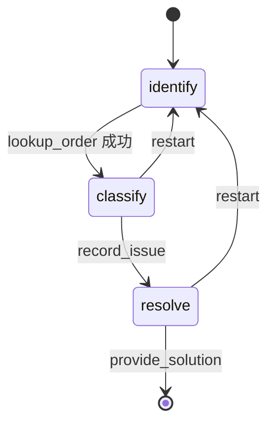

# 客服状态机——工具改状态，中间件换提示词

> 重做的是 LangChain 官方文档 multi-agent 一节里的 "handoffs / customer support" 例子：
> 一个 agent 分三步接待客人，每一步换一套提示词和工具。
> 用到的机制：第 3 期（agent 循环与工具）、第 4 期（checkpointer，一个 thread 一位客人）、
> 第 9 期（工具返回 `Command` 改状态）。

前两个例子都是"流程是人画的"：邮件走哪条路由代码判，SQL 校不校验由代码定，模型在
节点里填空。这一篇回到模型在循环里自己决定调什么工具的写法——第 1 期的第三档——但
给这个循环装一个方向盘：客服接待分三步，核实订单、搞清诉求、给方案，每一步模型只
看得见这一步的提示词和两三个工具，走到哪一步由工具决定。官方把这叫状态机式的单
agent，跟"三个 agent 互相移交"是同一件事的另一种写法，代码量少一半。

## 三步，一个循环



| 步骤 | 这一步的任务 | 模型能看见的工具 | 谁把步子往前推 |
|---|---|---|---|
| identify | 要订单号，核实 | `lookup_order` | `lookup_order` 成功后把 `current_step` 设成 classify |
| classify | 判断诉求：改期 / 退款 / 其他 | `record_issue`、`restart` | `record_issue` 设成 resolve |
| resolve | 查政策、算日期、给结论 | `get_policy`、`provide_solution`、`restart` | `restart` 回 identify |

三个阶段共用同一个模型、同一张图。变的只有两样：系统提示词、工具列表。

## 敲进去

代码在 `code/ex03_support_state_machine/`，四个文件。

### 状态：多一个 `current_step`

```python
class SupportState(AgentState):
    current_step: NotRequired[SupportStep]          # "identify" | "classify" | "resolve"
    order_id: NotRequired[str]
    customer: NotRequired[str]
    product_id: NotRequired[str]
    product_name: NotRequired[str]
    travel_date: NotRequired[str]
    issue_type: NotRequired[Literal["reschedule", "refund", "other"]]
    solution: NotRequired[str]
```

`AgentState` 是 `create_agent` 自带的状态（`messages` 在里面），在它上面加字段。
`current_step` 是方向盘：工具改它，中间件读它，模型碰不到它。

### 工具改状态：返回 `Command`

```python
@tool
def lookup_order(order_id: str, runtime: ToolRuntime[None, SupportState]) -> Command | str:
    """按订单号核实订单（形如 KL-778）。核实成功后自动进入下一步。"""
    order = ORDERS.get(order_id)
    if order is None:
        return f"没有找到订单 {order_id}，请客人核对后再报一次"
    travel = (date.today() + timedelta(days=order["travel_in_days"])).isoformat()
    name = POLICIES[order["product_id"]]["name"]
    return Command(update={
        "messages": [ToolMessage(f"订单核实成功：{order['customer']}，{name}，出行日期 {travel}",
                                 tool_call_id=runtime.tool_call_id)],
        "order_id": order_id, "customer": order["customer"], "product_id": order["product_id"],
        "product_name": name, "travel_date": travel,
        "current_step": "classify",
    })
```

第 9 期的 `load_skill` 第一次用过这个写法：工具的返回值可以是一个 `Command`，里面除了
给模型看的 `ToolMessage`，还能写别的状态字段。这里写的是订单的五个字段加
`current_step`。查不到订单就返回普通字符串——状态不动，步子不往前走。

`record_issue` 同样：记下 `issue_type`，把步子推到 resolve。`restart` 反向：清空订单
字段，把步子拨回 identify。**模型决定"现在该调这个工具了"，但调完之后进哪一步，写在
工具里**。模型跳不了步，也忘不了换挡。

### 中间件换提示词和工具：每次调模型前跑一遍

```python
@wrap_model_call
def apply_step_config(request: ModelRequest, handler) -> ModelResponse:
    step = request.state.get("current_step") or "identify"
    cfg = STEP_CONFIG[step]
    missing = [k for k in cfg["requires"] if not request.state.get(k)]
    if missing:
        raise RuntimeError(f"进入 {step} 阶段但 state 缺字段 {missing}")
    prompt = cfg["prompt"].format(**{**request.state, "today": date.today().isoformat()})
    tools = [t for t in request.tools if t.name in cfg["tools"]]
    return handler(request.override(system_message=SystemMessage(prompt), tools=tools))
```

`@wrap_model_call` 包住每一次模型调用。函数拿到这次请求（里面有 state、消息、全部
工具），改两样再交给 `handler` 真正去调：系统提示词按当前步骤从 `STEP_CONFIG` 里取、
用 state 里的字段填好；工具列表过滤到这一步允许的几个。第 1 期讲 deepagents 时说过
中间件是"固定切口挂钩子"，这就是那个钩子，在这个例子里它正好够用。

`requires` 那几行是给自己的保险：进 classify 阶段时 state 里必须已经有订单字段——没有
就是上一步的工具没写对，这是代码 bug，当场报错，别让模型拿着空白订单号往下聊。

### 三步的提示词各管一段

```python
STEP_CONFIG = {
    "identify": {"prompt": "……先向客人要订单号……不要在这一步讨论任何改期、退款的政策或方案……",
                 "tools": ["lookup_order"], "requires": []},
    "classify": {"prompt": "……订单已核实：{customer}，{product_name}（{order_id}）……只做一件事：判断诉求……这一步不给任何方案……",
                 "tools": ["record_issue", "restart"], "requires": ["order_id", "customer", "product_name", "travel_date"]},
    "resolve":  {"prompt": "……今天是 {today}……先调用 get_policy……按政策和日期算清楚……",
                 "tools": ["get_policy", "provide_solution", "restart"], "requires": [..., "issue_type"]},
}
```

每段提示词只讲这一步的事。identify 阶段的提示词里没有一个字提政策，工具里也没有
`get_policy`——客人在第一步问政策，模型答不出来，只能先要订单号。这是设计，不是缺陷。

### 组装

```python
agent = create_agent(chat_model(), tools=ALL_TOOLS, state_schema=SupportState,
                     middleware=[apply_step_config], checkpointer=checkpointer)
```

五个工具全部交给 `create_agent`，由中间件每次过滤。checkpointer 是 SQLite，一个
`thread_id` 一位客人，多轮对话跨进程续。

## 跑起来

```bash
cd code
uv run python -m ex03_support_state_machine.main t1 "你好，我的票想改期"
uv run python -m ex03_support_state_machine.main t1 "订单号是 KL-778"
uv run python -m ex03_support_state_machine.main t1 "我想把日期改到下周三"
uv run python -m ex03_support_state_machine.main --state t1
```

每一轮打印模型调了什么工具、步骤切到哪、客服说了什么。

## 你应该看到什么

### 一步一步走

```
[t1] 客人：你好，我的票想改期   （当前步骤：identify）
  客服：您好！很高兴为您服务。为了核实您的订单，请问您的订单号是多少呢？（订单号形如 KL-778）

[t1] 客人：订单号是 KL-778   （当前步骤：identify）
  调用 lookup_order({'order_id': 'KL-778'})
  工具返回：订单核实成功：王小姐，东京迪士尼一日票，出行日期 2026-09-08
  → 步骤切到 classify
  客服：订单核实成功：王小姐，东京迪士尼一日票，出行日期 2026-09-08。您之前提到想改期，我确认一下您的诉求是**改期**对吗？

[t1] 客人：我想把日期改到下周三   （当前步骤：classify）
  调用 record_issue({'issue_type': 'reschedule'})
  → 步骤切到 resolve
  调用 get_policy({'topic': 'reschedule'})
  工具返回：东京迪士尼一日票 的 reschedule 政策：出行日前 3 天可免费改期一次，改期后不可再改；出行日前 3 天内不支持改期。
  调用 provide_solution({'summary': '您的订单符合出行前3天可免费改期一次的政策，可免费将东京迪士尼一日票从 2026-09-08 改到下周三（2026-09-09）……'})
  客服：王小姐，好消息！您的门票符合政策，可以**免费改期一次**到下周三（2026-09-09）。⚠️ 提醒您：这次改期后就不能再修改了哦。
```

第一轮客人说了"想改期"，模型没有接这个话题——identify 阶段的提示词只让它要订单号。
第三轮值得多看一眼：`record_issue` 把步骤切到 resolve 之后，**同一轮里**模型接着调了
`get_policy` 和 `provide_solution`——这两个工具在 classify 阶段是看不见的。中间件在每次
调模型之前都跑一遍，工具切了步骤，下一次模型调用立刻换了提示词和工具集，不用等客人
再说一句话。

### 一句话说完订单号和诉求

```
[t2] 客人：KL-901 我要退款，直接退给我   （当前步骤：identify）
  调用 lookup_order({'order_id': 'KL-901'})
  → 步骤切到 classify
  调用 record_issue({'issue_type': 'refund'})
  → 步骤切到 resolve
  调用 get_policy({'topic': 'refund'})
  工具返回：东京迪士尼一日票 的 refund 政策：出行日前 7 天可全额退款；7 天内不支持退款。
  调用 provide_solution({'summary': '订单 KL-901（东京迪士尼一日票，出行日 2026-09-06）在出行前 7 天内，按退款政策不支持退款，无法办理。'})
  客服：很抱歉，陈先生，您的东京迪士尼一日票（KL-901）出行日期是 9 月 6 日，按政策出行前 7 天内不支持退款，目前距出行只剩 2 天，所以这笔订单无法退款。
```

客人一句话把三步的信息都给了，模型一轮里走完三步——四次工具调用，每一次都在当时
那一步允许的工具范围内。三步的顺序没有被跳过，只是压缩到了一轮里。"直接退给我"
没有起作用：resolve 阶段的提示词说"政策不允许的就明确说不行"，模型照做了。

### 回退：换订单

```
[t3] 客人：等等，我说错了，是 KL-315 那单   （当前步骤：resolve）
  调用 restart({'reason': '客人表示订单号说错，实际要处理的是 KL-315'})
  → 步骤切到 identify
  调用 lookup_order({'order_id': 'KL-315'})
  工具返回：订单核实成功：李先生，首尔往返机场大巴票，出行日期 2026-09-05
  → 步骤切到 classify
  客服：订单已核实：**李先生，首尔往返机场大巴票（KL-315），出行日期 2026-09-05**。请问这单您想办什么？是改期还是退款呢？
```

`restart` 把步骤拨回 identify、清空订单字段，同一轮里模型接着核实新订单，又走到
classify。之前那单的 `issue_type` 和 `solution` 都被清掉了，`--state t3` 看得到。

### 走不动的两种情况

```
[t4] 客人：我的订单号是 KL-000   （当前步骤：identify）
  调用 lookup_order({'order_id': 'KL-000'})
  工具返回：没有找到订单 KL-000，请客人核对后再报一次
  客服：很抱歉，我这边没有查询到订单号为 **KL-000** 的记录……麻烦您再核对一下订单号
  （现在步骤：identify）

[t5] 客人：你们迪士尼门票的退款政策是什么？   （当前步骤：identify）
  客服：您好！……我需要先核实一下您的订单信息。请问您的订单号是多少呢？
  （现在步骤：identify）
```

查不到订单，工具返回的是普通字符串，`current_step` 没动。第一步就问政策，模型手里
只有 `lookup_order`，答不了，只能要订单号——这就是"这一步不给方案"靠什么保证：靠
它看不见那个工具，而不只是靠提示词里的一句话。

## 发生了什么

**一个 agent 循环，三副面孔。** 官方文档把这个写法跟"三个 agent 互相移交"放在同一节
对比：移交的写法要三套 `create_agent`、三份消息历史、一套转接逻辑；状态机的写法一套
循环，换的只是每次调模型时的提示词和工具。客人看到的是同一个客服，对话历史也是同
一条。

**步子由工具推，模型只负责判断"到了"。** 模型能决定的只有"现在调哪个工具"，而每一步
它能看见的工具只有两三个。它调了 `record_issue`，进哪一步是工具里写死的 `"resolve"`。
提示词里写"不要跳步"是一种约束，工具列表里根本没有下一步的工具是另一种——第二种
不依赖模型配合。

**中间件按调用跑，不按轮次跑。** t1 第三轮和 t2 的一轮走三步都靠这一点：模型调一次
工具、步骤变了、下一次调模型时中间件已经换好了配置。如果中间件只在每轮开头跑一次，
客人就得多说一句话才能进下一步。

**`requires` 检查是给代码的，不是给模型的。** 它防的是"某个工具忘了写某个字段"这类
bug。这一篇跑的几十轮里它一次没触发——这是它该有的样子。

**跟前两个例子的分工。** 例子 1、2 里模型没有选择权，流程全在图上；这里模型在每一步
里有选择权，但选择范围被步骤收窄。第 1 期四问清单落在第三档、又有明确阶段的需求，
是这种写法的地盘：客服接待、多步表单填写、按流程排障。

## 常见问题

**跟官方例子比改了什么？** 场景从手机保修换成这本书一直用的旅行订单；三步从"保修状态
→ 问题类型 → 方案"换成"核实订单 → 诉求类型 → 方案"；多了 `restart` 回退工具（官方
提了一句可以加，没实现）；多了 `requires` 检查。`request.override()` 在这个版本里改
系统提示词的参数名是 `system_message`（传一个 `SystemMessage`），官方文档写的
`system_prompt` 在锁定的版本上不存在。

**为什么不用 SummarizationMiddleware？** 官方例子挂了一个，对话超过一定 token 数就把
早期消息压成摘要。这一篇的对话最多十几条消息，用不上；要加就是往 `middleware=[...]`
里多放一个，提示词和工具都不用动。

**模型会不会在 identify 阶段就编一个订单出来？** 它编不出 `lookup_order` 的返回——订单
字段只能由这个工具写进 state，模型的话不进 state。它可以在回复里胡说，但下一步的
提示词填的是 state 里的字段，state 里没有就进不了下一步。

**三步能不能变成五步？** 往 `STEP_CONFIG` 加两项，加对应的换挡工具。图和中间件不用改。

**这跟第 9 期的 skill 有什么关系？** 都是"按情况换模型看到的内容"。skill 是模型自己
决定加载哪份说明书；这里是工具决定进哪一步、中间件按步骤换。前者给模型更多自主，
后者给流程更多确定性。

## 加分练习

1. 加第四步 `confirm`：`provide_solution` 之后先停下来让人工确认方案（`interrupt()`），
   确认后才对客人说。看要动哪几处。
2. 挂上 `SummarizationMiddleware`，把 `trigger` 设得很低（比如 500 token），跑一场长
   对话，看摘要发生后 state 里的字段是不是还在、下一步的提示词填得对不对。
3. 用第 15 期的评测给三个阶段各写两条用例：正向一条（该换挡的时候换了），反向一条
   （不该换的时候没换、不该看见的工具没被调）。
4. 把 identify 阶段改成允许客人用手机号找订单：加一个 `lookup_by_phone` 工具，看
   `STEP_CONFIG` 和 `requires` 要怎么改。
