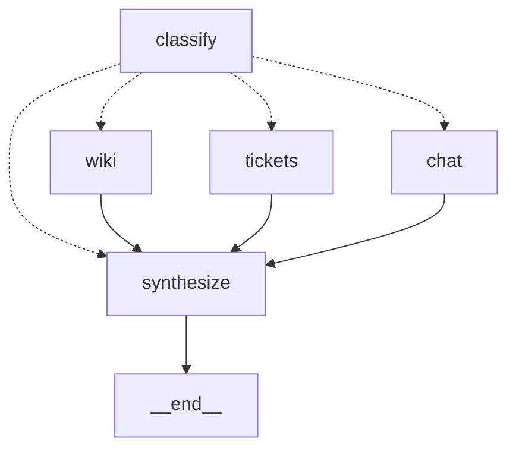

# 多源知识库路由——Send 并行扇出再汇合

> 重做的是 LangChain 官方文档 multi-agent 一节里的 "router / multi-source knowledge base"
> 例子：一个问题拆给几个知识来源并行查，再合成一个回答。
> 用到的机制：第 10 期（`Send` 扇出、带 reducer 的字段）、第 3 期（工具与 agent 循环）、
> 例子 1 的 json_mode 结构化输出。

企业里的知识散在几个地方：正式文档一处，历史工单一处，同事在群里说过的经验又是一处。
一个问题往往三处都要看——规则怎么写的、以前怎么处理的、最近有没有人提醒过什么。这一篇
的图就干这件事：先判断问题该问哪几个来源、各自问什么，把子问题并行派出去，每个来源一个
小 agent 自己搜自己汇报，最后合成一个带出处的回答。官方例子的三个来源是 GitHub、Notion、
Slack；这一篇换成这本书一直用的旅行客服场景：政策文档、历史工单、客服群聊。

## 一张图，三条并行的路



`classify` 是一次模型调用，输出"选哪几个来源、每个来源问什么"；条件边把这个列表变成一组
`Send`，每个 `Send` 带着自己的子问题去一个来源节点；三个来源节点各跑一个小 agent；跑完的
结果靠 reducer 追加进同一个列表；`synthesize` 再调一次模型合成。

跟第 10 期的差别在"扇出几份、发给谁"由谁定：第 10 期是状态里订单号列表的长度，代码定；
这里是分类那一步模型的判断。分类是模型的活，之后的并行、隔离、汇合是图的活。

## 敲进去

代码在 `code/ex04_router_knowledge_base/`：`sources.py`（三个来源的搜索工具和小 agent）、
`graph.py`（图）、`state.py`、`main.py`，`data/` 里三份假数据。

### 状态：结果字段带 reducer

```python
class RouterState(TypedDict, total=False):
    question: str
    classifications: list[Classification]                  # [{"source": ..., "query": ...}]
    results: Annotated[list[SourceResult], operator.add]   # 三个来源并行写，追加不覆盖
    final_answer: str


class SourceInput(TypedDict):
    source: Source
    query: str
```

`results` 上的 `operator.add` 是并行写同一个字段的前提——第 10 期用的是字典合并，这里
用列表拼接，道理一样：几个节点同时返回，reducer 决定怎么合，没有 reducer 就是后写的
覆盖先写的。`SourceInput` 是 `Send` 派给来源节点的输入类型：只有它自己的子问题。

### 分类：模型选来源，代码兜底

```python
def classify(state: RouterState) -> dict:
    out = classifier.invoke(CLASSIFY.format(sources=..., question=state["question"]))
    picks = [c for c in out.get("classifications", []) if c.get("source") in AGENTS and c.get("query")]
    return {"classifications": picks}
```

提示词给模型三个来源各一句描述，让它输出一个列表——可以选一个、两个、三个，也可以一个
都不选。结构化输出照例走 json_mode（例子 1 试出来的），`picks` 那行把不认识的来源名和
空子问题过滤掉。

### 扇出：条件边返回一组 Send

```python
def route(state: RouterState) -> list[Send] | Literal["synthesize"]:
    if not state["classifications"]:
        return "synthesize"
    return [Send(c["source"], {"source": c["source"], "query": c["query"]}) for c in state["classifications"]]


builder.add_conditional_edges("classify", route, [*AGENTS, "synthesize"])
```

条件边函数返回的是一组 `Send`，每个 `Send` 说"去哪个节点、带什么输入"。同一个节点可以
被多个 `Send` 指向，也可以一个都不指——一个来源都没选中就直接去汇总。这跟第 10 期
`route_after_tools` 的写法完全一样。

### 来源节点：一个小 agent，只看自己的子问题

```python
def make_source_node(source: str):
    def node(inp: SourceInput) -> dict:
        result = AGENTS[source].invoke({"messages": [HumanMessage(inp["query"])]})
        return {"results": [{"source": source, "result": result["messages"][-1].content, ...}]}
    return node
```

```python
AGENTS = {
    "wiki": create_agent(chat_model(), tools=[search_wiki], system_prompt="你负责内部政策与流程文档这一个来源……"),
    "tickets": create_agent(chat_model(), tools=[search_tickets], system_prompt="……"),
    "chat": create_agent(chat_model(), tools=[search_chat], system_prompt="……"),
}
```

每个来源一个 `create_agent`，只有一个搜索工具，提示词让它"可以换关键词多搜一两次，最后
用一段话汇报找到了什么、出处是哪条"。三个 agent 拿到的输入只有各自的子问题，看不见原
问题的全文，也看不见别的来源在查什么——第 10 期讲的隔离，这里靠 `Send` 的输入天然做到。
返回值是一个单元素列表，`operator.add` 把三份拼成一份。

### 汇合：带出处合成

```python
def synthesize(state: RouterState) -> dict:
    results = state.get("results", [])
    if not results:
        return {"final_answer": "这个问题跟三个知识来源都不相关，我这里查不到。"}
    reports = "\n\n".join(f"【{r['source']}】\n{r['result']}" for r in results)
    reply = llm.invoke(SYNTHESIZE.format(question=state["question"], reports=reports))
    return {"final_answer": reply.content.strip()}
```

提示词的要求：规则引文档，案例引工单，经验引聊天记录，每条结论标出处，汇报里没有的
不要编。

## 跑起来

```bash
cd code
uv run python -m ex04_router_knowledge_base.main "客人机场大巴票过了出发时间还能退吗？以前有没有类似的处理？"
uv run python -m ex04_router_knowledge_base.main "群里最近谁提到过发票抬头改不了的事，怎么处理的？"
uv run python -m ex04_router_knowledge_base.main "今天北京天气怎么样？"
```

没有 checkpointer：一问一答。

## 你应该看到什么

### 三个来源都要问

```
=== 客人机场大巴票过了出发时间还能退吗？以前有没有类似的处理？ ===
  路由 -> wiki：机场大巴车票的退改签政策是什么？特别是超过发车时间后是否允许退票？
  路由 -> tickets：是否有关于机场大巴票过期后申请退款的工单？处理结果如何？
  路由 -> chat：客服同事是否分享过机场大巴票超时后退款的经验或提醒？
  [wiki] 开始：……
  [tickets] 开始：……
  [chat] 开始：……
  [wiki] 结束（3.09s）
  [chat] 结束（8.19s）
  [tickets] 结束（10.22s）

（总耗时 21.0s）

回答：
按现有规则，机场大巴票过了出发时间**不能直接退**：
- 文档《机场大巴票退款规则》写明：已过原出发时间的票视为已使用，系统不支持退款；只有特殊情况可走人工审批流程。（来源：wiki《机场大巴票退款规则》）

以前有类似工单，处理结果分两种情况：
1. 有航班延误证明，可特殊审批部分退款——工单 T-2041（2026-07-12）……主管批准退 80%……
2. 无任何证明，按规则拒绝退款——工单 T-2087（2026-07-30）……

另外，客服同事近期经验也提到：最近航班延误比较多，只要客人能提供航班延误截图，主管基本都会批，提醒不要一上来就拒绝。（来源：客服群聊天记录，小周 2026-09-02）
```

三个来源同一时刻开始，结束时间 3 秒、8 秒、10 秒依次拉开——并行是真的，不是排队。
总耗时 21 秒里，三个来源占 10 秒（最慢那个），分类和合成各占几秒。回答按"规则、案例、
经验"三层组织，每层标了出处，"过期后无条件全额退款"这条没有先例，它也说了。

子问题是模型改写过的，比原问题更具体：给 wiki 的问"政策是什么、超过发车时间是否允许"，
给 tickets 的问"有没有工单、处理结果如何"，给 chat 的问"同事有没有分享过经验"——同一个
问题，三个来源要找的东西不一样。

### 只有一个来源相关

```
=== 群里最近谁提到过发票抬头改不了的事，怎么处理的？ ===
  路由 -> chat：在客服群聊天记录中，最近谁提到过'发票抬头改不了'的问题？具体是怎么处理的？
  [chat] 结束（4.67s）

（总耗时 9.8s）

回答：
- 小周（2026-08-26）……处理方式是后台"作废重开"，入口路径为 订单管理 → 财务 → 作废重开……
- 老陈（2026-08-27）补充……作废重开每单只能操作一次……
```

"群里谁提到过"——分类只选了 chat。文档和工单里其实也有发票抬头的内容，但问题问的是
谁说过、怎么说的，模型判断另两个来源用不上。少扇出两份，省的是两个 agent 各自几次模型
调用。

### 一个来源都不相关

```
=== 今天北京天气怎么样？ ===
  路由 -> 没有相关来源

（总耗时 1.9s）

回答：
这个问题跟三个知识来源都不相关，我这里查不到。
```

`route` 返回 `"synthesize"`，一个 `Send` 都没发，1.9 秒结束——只有分类那一次模型调用。

### 合成那一步的一个毛病

第四个问题"台风闭园怎么处理、上次怎么批量做的、有没有话术"，三个来源都命中，回答里
把规则（《极端天气处理规范》）、案例（工单 T-2133，214 单里 176 改期 38 退款）、话术位置
（老陈说在共享盘 `/客服/极端天气/`）都对上了。但它多写了两条出处：

```
——出处：相关文档检索补充说明
——出处：历史工单检索结论
```

这两个"出处"在三份汇报里都不存在——合成那一步把自己的推断也套上了出处的格式。提示词
说了"每条结论标出处"，模型把"标出处"执行得很彻底，连不该有出处的句子也标了。修法在
常见问题里。

## 发生了什么

**扇出几份由模型定，这是这一篇跟第 10 期最大的差别。** 第 10 期"查三个订单"，扇出三份是
状态里列表长度决定的，模型只负责把订单号传对。这里"问哪几个来源"没有代码能判的依据——
"群里谁提到过"该只问 chat，"能不能退、以前怎么处理"该三个都问，这是理解问题的活。所以
分类那一步交给模型，但它的输出被约束成一个枚举列表，代码过滤掉不认识的来源，再由图
负责并行和汇合。模型定"要不要"，图定"怎么跑"。

**每个来源一个小 agent，而不是一个大 agent 拿三个工具。** 官方文档把这叫 router 模式，
跟"一个 agent 手里有三个搜索工具自己决定调哪个"的 subagents 模式并列。区别是并行和
隔离：三个小 agent 同时跑，各自的上下文里只有自己那个来源的搜索结果，汇报时不会把
文档里的话说成是群里谁讲的。一个大 agent 顺序调三个工具，慢三倍，三份搜索结果还堆在
同一段上下文里。

**`Send` 的输入就是隔离的边界。** 来源节点的入参类型是 `SourceInput`，只有 `source` 和
`query` 两个字段，不是整个 `RouterState`。原问题、别的来源的子问题、别的来源的结果，
它都拿不到。第 10 期用手动 `subgraph.invoke()` 做到的隔离，这里 `Send(node, input)`
一行就做到了。

**合成是最容易出问题的一步。** 三份汇报都对，合出来的回答多了两个不存在的出处。合成
那一步拿到的是三段自由文本，"出处"只是文本里的措辞，模型分不清哪句是引用、哪句是
汇报者的补充。要让出处可靠，得让来源节点返回结构化的引用（文档标题 / 工单号 / 发言人
和日期），合成时只允许引用列表里有的——这是第 15 期"结果打分器"能钉住的行为，也是
加分练习。

## 常见问题

**来源之间有依赖怎么办，比如先查文档再按文档里的工单号查工单？** 这一篇的三个来源是
平行的，一次扇出就够。有依赖的用两轮：第一轮的结果进 state，第二轮再 `Send`。图上就是
`synthesize` 之前多一层节点。

**分类选错了来源会怎样？** 选多了，多跑一个 agent，它汇报"没找到"，合成时忽略——成本是
几次模型调用；选少了，答案缺一块，合成时看不出来。所以宁可让分类多选：提示词里"跟问题
无关的来源不要选"是为了省钱，真实场景如果准确比省钱重要，可以改成"拿不准就选上"。

**三个来源的搜索工具都是关键词匹配，太弱了。** 是。真实场景换成各系统自己的搜索 API
或第 8 期那种 embedding 检索，只改 `sources.py` 里三个 `@tool` 函数的内部，图不动。这一篇
的重点在路由和并行，检索质量是另一个问题。

**怎么修合成时编出处的毛病？** 两步。来源 agent 的汇报改成结构化输出：`{"findings": [{"text":
..., "citation": ...}]}`，citation 只能是搜索工具返回过的标识。合成时把所有 citation 列成
一张表给模型，提示词改成"只能用这张表里的出处"，再用代码检查回答里出现的出处是否都在
表里。第一步是本篇加分练习 2。

**为什么没有 checkpointer？** 一问一答，没有第二轮。要做成多轮对话（"那 T-2041 那单具体
怎么批的？"），给图加 checkpointer、把 `question` 换成 `messages`，分类时看整段对话。

## 加分练习

1. 把第 10 期那个客服 agent 的 `search_faq` 工具换成这张图：客人问通用问题时，agent 调一个
   工具，工具内部跑这张路由图，返回合成的回答。看两层 agent 嵌套时耗时怎么变。
2. 让三个来源 agent 用结构化输出返回 `findings` 加 `citation`，合成时只允许引用已有的
   citation，用代码校验回答里的出处。重跑台风那个问题，看那两条假出处还在不在。
3. 给分类加一条"拿不准就选上"的规则，跑十个问题，统计多选了几次、多花了多少时间。
4. 把三个来源的搜索工具换成第 8 期的 embedding 检索（同一个 bge 模型对三份数据建索引），
   看子问题的改写对召回有没有帮助——模型改写过的子问题和原问题分别搜一次，比命中。
