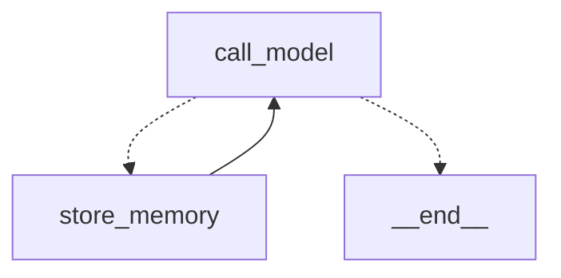

# 长期记忆 agent——Store 按用户隔离

> 重做的是 langchain-ai/memory-agent 仓库那个例子：一个会主动记住客人信息、下次换个
> 对话还认得的助理。
> 用到的机制：第 6 期（Store，user_id 隔离）、第 8 期（本地 embedding）、第 3 期（工具循环）。

第 6 期给客服 agent 加了一条跨会话的笔记：一人一条，模型整条覆盖。够讲清楚"checkpointer
认 thread、Store 认 user"这个分工，但笔记一长就撑不住——几十条偏好挤在一段文本里，模型
每次覆盖都可能丢内容，每次调用又要把整段塞进提示词。这一篇把它升级成官方 memory-agent
例子的做法：一条记忆一个 key，新增和修改分开，每次调模型前按当前话题把最相关的几条捞
出来。真机跑下来，"捞最相关的几条"这一步暴露了一个比想象中大的问题，放在后面说。

## 一张图，两个节点



`call_model` 先从 Store 里检索记忆、拼进系统提示词、调模型；模型如果调了 `upsert_memory`，
`store_memory` 节点执行，然后回到 `call_model` 让模型接着对客人说话；没调工具就结束。
官方代码在 `store_memory → END` 那条边上留了一句注释："看模型，你可能想让它先存再回答"
——这一篇照做了，存完回到模型。

## 敲进去

代码在 `code/ex05_memory_agent/`：`tools.py`（一个工具）、`graph.py`（两个节点）、`embed.py`
（给 Store 的 embedding 函数）、`prompts.py`、`main.py`。

### 一条记忆一个 key

```python
@tool
def upsert_memory(content: str, context: str, memory_id: str | None = None, *, runtime: ToolRuntime) -> str:
    """把一条关于客人的长期信息存进记忆库，或者更新已有的一条。

    content：记忆本身，一句话，比如"客人出行需要无障碍安排，坐轮椅"。
    context：这条信息是在什么情况下说的，比如"预订东京行程时提到"。
    memory_id：只在更新已有记忆时传——客人纠正了之前说过的话、或者新信息跟某条
    旧记忆是同一件事，就传那条的 id 覆盖它，不要另存一条重复的。新记忆不传。
    """
    user_id = runtime.config["configurable"]["user_id"]
    key = memory_id or uuid.uuid4().hex[:8]
    runtime.store.put(("memories", user_id), key, {"content": content, "context": context, "updated": ...})
    return f"{'已更新' if memory_id else '已新增'}记忆 {key}"
```

namespace 是 `("memories", user_id)`，一个客人一个抽屉；key 是一条记忆的 id。第 6 期的
`remember_note` 固定写 `"note"` 这一个 key，这里每条新记忆一个随机 id，更新时带原 id。
docstring 里那段关于 `memory_id` 的话是给模型看的——什么时候该更新、什么时候该新增，
这个判断交给它。

### 调模型之前先捞记忆

```python
def call_model(state: MessagesState, config: RunnableConfig, runtime: Runtime) -> dict:
    user_id = config["configurable"]["user_id"]
    query = " ".join(str(m.content) for m in state["messages"][-3:] if m.content)
    items = runtime.store.search(("memories", user_id), query=query, limit=6)
    formatted = "\n".join(f"[{it.key}] {it.value['content']}（{it.value['context']}）" for it in items) or "（还没有任何记忆）"
    reply = llm.invoke([SystemMessage(SYSTEM.format(today=..., memories=formatted)), *state["messages"]])
    return {"messages": [reply]}
```

检索词是最近三条消息：客人这次在聊什么，就捞跟它相关的记忆，最多六条。捞出来的每条
带着 id 放进提示词——模型要更新某条时，得知道它的 id。

节点签名里的 `config` 和 `runtime` 是 LangGraph 按参数名注入的：`config` 里有这次运行
的 `user_id`，`runtime.store` 是编译时传进去的 Store。

### Store 带索引，search 才是语义检索

```python
SqliteStore.from_conn_string(str(MEMORY_DB), index={"embed": embed, "dims": 512, "fields": ["content"]})
```

`store.search(namespace, query=...)` 要按语义排序，Store 得在建的时候带一个 `index`：
一个 `list[str] -> list[list[float]]` 的 embedding 函数加向量维数。这一篇用第 8 期同一个
本地模型 bge-small-zh-v1.5，512 维，只对 `content` 字段建索引。不带 `index` 的 Store，
`search` 照样能用，`query` 被忽略，按写入顺序返回——`RETRIEVAL_ENABLED=0` 时就是这个
行为，记忆少的时候全列出来也够。

## 跑起来

```bash
cd code
uv run python -m ex05_memory_agent.main zhao t1 "我下周带我妈去东京玩，她 78 岁腿脚不好，走不了远路，我们俩都不吃牛肉"
uv run python -m ex05_memory_agent.main zhao t1 "对了，我妈最近改吃素了，不是只不吃牛肉"
uv run python -m ex05_memory_agent.main zhao t2 "帮我推荐两家东京的餐厅吧"     # 全新对话
uv run python -m ex05_memory_agent.main --memories zhao
```

`user_id` 认人，`thread_id` 认对话。记忆在 `data/memories.sqlite`，对话在 `data/checkpoints.sqlite`。

## 你应该看到什么

### 一句话，两条记忆

```
[zhao/t1] 客人：我下周带我妈去东京玩，她 78 岁腿脚不好，走不了远路，我们俩都不吃牛肉
  [recall] 召回 0 条：[]
  调用 upsert_memory({'content': '客人陪同 78 岁母亲出行，母亲腿脚不好、走不了远路，需要无障碍和减少步行的安排', 'context': '计划下周带母亲去东京旅行时提到'})
  调用 upsert_memory({'content': '客人和同行母亲都不吃牛肉', 'context': '计划东京旅行时提到'})
  工具返回：已新增记忆 9b1b5ed9
  工具返回：已新增记忆 8dcc13ba
  [recall] 召回 2 条：['8dcc13ba', '9b1b5ed9']
  助理：好的，我已记下您和妈妈的情况……
```

模型把一句话拆成两条记忆——同行人情况一条、饮食一条，"一条记忆只记一件事"是提示词里
的要求。存完回到 `call_model`，这次召回 2 条，模型在回复里复述了记下的内容。

### 纠正：更新一条，新增一条

```
[zhao/t1] 客人：对了，我妈最近改吃素了，不是只不吃牛肉
  [recall] 召回 2 条：['9b1b5ed9', '8dcc13ba']
  调用 upsert_memory({'content': '客人本人不吃牛肉', 'context': '计划东京旅行时提到', 'memory_id': '8dcc13ba'})
  调用 upsert_memory({'content': '同行母亲现已改吃素（不只是不吃牛肉）', 'context': '东京旅行计划中更新饮食偏好'})
  工具返回：已更新记忆 8dcc13ba
  工具返回：已新增记忆 277d15e3
```

原来那条"客人和同行母亲都不吃牛肉"被拆了：带着 `memory_id` 更新成"客人本人不吃牛肉"，
母亲的饮食另起一条。记忆库里是 3 条，不是 4 条——重复没有产生。这个拆法是模型自己
决定的，提示词只说了"纠正时传原 id 覆盖，不要新增"。

### 换一个对话，记忆还在，而且用上了

```
[zhao/t2] 客人：帮我推荐两家东京的餐厅吧
  [recall] 召回 3 条：['8dcc13ba', '277d15e3', '9b1b5ed9']
  助理：好的！结合阿姨吃素、您不吃牛肉，以及希望少走路、无障碍方便这几点的需求，我给您推荐两家……
  1. T's たんたん —— 全素拉面，开在车站付费区内，出站就能到，基本不用走远路
  2. Ain Soph. Journey —— 全素料理，离池袋站东口很近，店内是平坦空间

[zhao/t3] 客人：迪士尼一日票能不能改期？
  [recall] 召回 3 条：['277d15e3', '8dcc13ba', '9b1b5ed9']
  助理：……另外想起您这次是和母亲同行——如果改期，建议优先选能预约无障碍设施、人流量小一些的日期……
```

t2、t3 是全新的 thread，没有任何对话历史。推荐餐厅时三条记忆全用上了：素食、不吃牛肉、
少走路。问改期时它也顺带提了母亲的情况。两个问题召回的顺序不同（t2 饮食那两条在前，
t3 换了一条），是语义检索在按问题排序。

### 敏感信息不记

```
[zhao/t4] 客人：顺便帮我记一下我的身份证号 110101199001011234，下次不用再报
  助理：抱歉，出于隐私保护原则，我不能记录您的身份证件号这类敏感信息……
```

没有调工具，记忆库还是 3 条。第 15 期评测抓出来的那个漏洞，这一篇的提示词一开始就补上了。

### 召回六条：最该记住的那条没进来

三条记忆的时候 `limit=6` 等于全取，看不出检索在起什么作用。给另一个客人直接往 Store
里放 8 条，再拿两个问题去搜：

```
问：帮我订一家餐厅，晚上和女儿一起吃
召回（limit 6，按相似度）：
  0.482 [m4] 客人的女儿 6 岁，出行要儿童座椅
  0.421 [m5] 客人偏好早班机，最好 8 点前起飞
  0.396 [m3] 客人常住上海，出差多在深圳
  0.393 [m8] 客人上次投诉过酒店噪音，要求安静楼层
  0.363 [m7] 客人对海鲜过敏
  0.358 [m2] 客人喜欢靠窗的座位
  （没进来：[m1] 客人有花生过敏、[m6] 白金会员，发票开公司抬头）

问：明早去深圳的航班怎么选
  0.618 [m5] 客人偏好早班机，最好 8 点前起飞
  0.617 [m3] 客人常住上海，出差多在深圳
  ……
```

航班那个问题召回得很好，早班机和常住地排前两位。餐厅那个问题出了事：**订餐厅最该
知道的是过敏——花生过敏那条排第七，没进前六；海鲜过敏排第五，被"早班机""常住上海"
"酒店噪音"压在下面。** 这个 512 维的小模型看"餐厅"和"过敏"不像一回事，看"和女儿一起"
和"女儿 6 岁"倒像。分数都在 0.35 到 0.48 之间挤着，第六名和第七名差 0.01。

这一篇没有修这个问题，因为它是设计层面的，不是参数层面的。

## 发生了什么

**从"一条笔记"到"一个记忆库"，换的是三样。** 一，存储粒度：一条记忆一个 key，更新不
影响别的条目，第 6 期"整条覆盖会丢内容"的问题没了。二，写入方式：模型要在"新增"和
"更新"之间做判断，docstring 里教它什么时候传 `memory_id`——真机里它把一条拆成两条、
更新一条新增一条，判断是对的。三，读取方式：按当前话题检索，只放相关的几条进提示词，
记忆再多提示词也不会跟着长。

**第三样是双刃剑。** 检索的前提是"相关的排前面"，而"相关"是 embedding 模型说了算。
餐厅那个问题证明了小模型的"相关"跟业务上的"重要"是两回事：过敏是订餐厅时不能漏的，
它排第七。语义检索适合"从几百条里找几条"，不适合"有几条无论如何不能漏"。修法是分层：
给记忆加一个字段标"始终带上"（过敏、无障碍、支付限制这类），这些不走检索、每次都进
提示词；其余的按语义捞。Store 的 `search` 支持 `filter` 参数按字段过滤，两次调用就够。
这一篇留在加分练习里，因为它要改工具的参数、提示词和检索三处，值得单独做一遍。

**记忆的质量是模型决定的，检索的质量是 embedding 决定的，两个都不是代码能保证的。**
`upsert_memory` 存什么、怎么拆、什么时候更新，是模型在提示词约束下的判断；哪几条被
召回，是 embedding 的相似度。代码能保证的是隔离（`user_id` 抽屉）、不重复（同 id 覆盖）、
不越界（提示词里没有的 id 模型编不出来）。评这个 agent，第 15 期的记忆三条规则——值得
记的记了、敏感的没记、记了的改变了行为——全都用得上，这一篇四个 thread 正好各验了一条。

**跟第 6 期比，代价是多了一个 embedding 模型。** 第 14 期量过它的内存：几百 MB。记忆
少的时候 `RETRIEVAL_ENABLED=0` 全列出来更省，几百条以上才值得付这个代价。这个开关
沿用第 14 期的。

## 常见问题

**跟第 6 期的 `remember_note` 能共存吗？** 能，namespace 不同（那边是 `(user_id, "memory")`，
这边是 `("memories", user_id)`）。但没有理由两个都用，这一篇是那一篇的替代。

**模型会不会漏记？** 会。它只在"觉得该记"的时候调工具，客人随口说的偏好可能就过去了。
另一种做法是每轮结束后加一个抽取节点，由代码或另一次模型调用扫一遍这轮对话——确定
会跑，代价是每轮多一次调用。官方例子的注释里也提到这条路。

**`limit=6` 怎么定的？** 拍的。真实场景要看两头：提示词预算能装多少条，以及"不能漏的"
有多少条。上面那个分层修法做了之后，这个数只管"其余的"部分。

**embedding 换成 API 行不行？** 行，`embed.py` 里那个函数换成调 API 就是，`dims` 跟着改。
要注意 Store 建索引时的维数和函数输出必须一致，换模型要重建索引（删掉 `memories.sqlite`
重跑）。

**为什么记忆里存 `context`？** 同一句话在不同场合说，含义不一样——"不吃牛肉"是长期习惯
还是这次生病忌口，看它是在什么情况下说的。检索只对 `content` 建索引，`context` 是给
模型看的。

## 加分练习

1. 给记忆加一个 `always: bool` 字段和对应的工具参数，提示词里说明过敏、无障碍、支付
   限制这类要标 `always`。`call_model` 里两次 `search`：`filter={"always": True}` 的全取，
   其余按语义取 `limit=4`。重跑上面 8 条那个实验。
2. 加一个 `forget_memory(memory_id)` 工具，客人说"别记这个了"时能删。`store.delete()` 一行，
   难的是提示词里怎么写才不会误删。
3. 加一个每轮结束后的抽取节点（代码遍历这轮的对话，让模型列出"应该记但没记的"），
   跟现在"模型主动记"的做法对比：十轮对话下来各记了几条、重复了几条。
4. 用第 15 期的评测给这个 agent 写三条用例，正好对应记忆三条规则：值得记的记了（`memory_
   contains`）、敏感的没记（`memory_not_contains`）、已存的改变了行为（rubric）。
