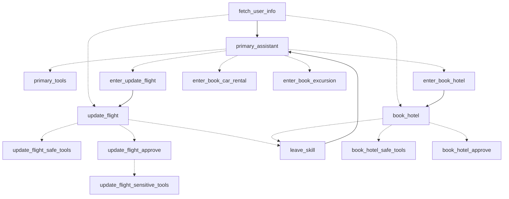

# 航空客服四段式——从零样本到子助理路由

> 重做的是 LangGraph 官方最长的那个教程 "Build a Customer Support Bot"：一家航空公司的客服，
> 管机票改签、酒店、租车、景点，分四版逐步加控制。数据是官方公开的 travel2.sqlite（真实
> 规模：3 万多个航班、36 万张票）。
> 用到的机制：第 3 期（工具循环）、第 5 期（interrupt）、第 10 期（多 agent）、例子 3（状态里
> 记着谁在接待）。

前面五个例子每个都是一张图。这一篇是同一个需求的四张图，一版比一版多一道控制：先让模型
拿着 17 个工具随便干，看它出什么事；然后每次动工具前都停下来问人；然后只对"会改数据"的
工具问人；最后把 17 个工具拆给四个专项助理，主助理只负责查信息和转交。官方教程写这四版
是为了教"按产品需要重构一张图"，这一篇照着走一遍，每版都跑同一段对话，把差别摆在一起看。

## 四张图

| 版本 | 图上多了什么 | 解决前一版的什么问题 |
|---|---|---|
| v1 零样本 | 一个助理节点 + 一个工具节点，17 个工具全给它 | —— |
| v2 每次确认 | 开头多一个 `fetch_user_info`；任何工具执行前经过 `approve` 闸门 | v1 没问就订了东西；v1 得先调一次工具才知道客人是谁 |
| v3 写操作才确认 | 工具拆成 `safe_tools`（查）和 `sensitive_tools`（订/改/取消），只有后者前面有闸门 | v2 连查个航班都要人点一下 |
| v4 专项助理 | 主助理 + 四个专项助理，各自一小组工具、各自的闸门；`dialog_state` 栈记着现在谁在接待 | v3 一份提示词管 17 个工具，工具越多越乱 |



（v4 的图，只画了两个专项助理，另两个长得一样。）

## 敲进去

代码在 `code/ex06_airline_support/`：`db.py`（下载和重置数据）、`tools.py`（17 个工具）、
`prompts.py`、`graphs.py`（四个 `build_vN`）、`main.py`。

### 工具：passenger_id 从 config 拿，模型碰不到

```python
def _passenger(runtime: ToolRuntime) -> str:
    pid = runtime.config.get("configurable", {}).get("passenger_id")
    if not pid:
        raise ValueError("config 里没有 passenger_id")
    return pid


@tool
def update_ticket_to_new_flight(ticket_no: str, new_flight_id: int, runtime: ToolRuntime) -> str:
    """把乘客的机票改到另一个航班。起飞前不足 3 小时的航班不允许改。"""
    pid = _passenger(runtime)
    with db.connect() as conn:
        ...
        if not conn.execute("SELECT 1 FROM tickets WHERE ticket_no = ? AND passenger_id = ?", (ticket_no, pid)).fetchone():
            return f"当前乘客 {pid} 不是机票 {ticket_no} 的持有人"
        conn.execute("UPDATE ticket_flights SET flight_id = ? WHERE ticket_no = ?", (new_flight_id, ticket_no))
```

调图的人在 `config` 里传 `passenger_id`，工具从 `runtime.config` 里读——模型不知道这个值，
也改不了，一个乘客看不到、改不动另一个乘客的票。"起飞前不足 3 小时不许改"这条规则写在
工具里，提示词里也有，官方教程的原话是：政策的**执行**必须在工具里做，模型永远可能忽略
提示词。

17 个工具按领域分四组，每组"查"是安全工具、"订/改/取消"是敏感工具：

```python
FLIGHT_SAFE, FLIGHT_SENSITIVE = [search_flights], [update_ticket_to_new_flight, cancel_ticket]
HOTEL_SAFE, HOTEL_SENSITIVE = [search_hotels], [book_hotel, update_hotel, cancel_hotel]
...
SAFE_TOOLS = [fetch_user_flight_information, lookup_policy, *FLIGHT_SAFE, *CAR_SAFE, *HOTEL_SAFE, *TRIP_SAFE]
SENSITIVE_TOOLS = [*FLIGHT_SENSITIVE, *CAR_SENSITIVE, *HOTEL_SENSITIVE, *TRIP_SENSITIVE]
```

### 闸门：一个节点，四版复用

```python
def make_approve(next_node: str, back_to: str) -> Callable:
    def approve(state: State) -> Command:
        calls = state["messages"][-1].tool_calls
        decision = interrupt({"pending": [{"tool": c["name"], "args": c["args"]} for c in calls], ...})
        if str(decision).strip().lower() in ("y", "yes", "approve", "批准", "同意"):
            return Command(goto=next_node)
        denied = [ToolMessage(content=f"用户拒绝了这次操作。原因：'{decision}'。请据此继续帮助用户。",
                              tool_call_id=c["id"]) for c in calls]
        return Command(update={"messages": denied}, goto=back_to)
    return approve
```

官方用编译期的 `interrupt_before=["tools"]` 停图，恢复时靠图外面的代码判断用户说了什么、
决定是 `invoke(None)` 继续还是塞一条拒绝的 `ToolMessage`。这一篇按这本书从第 5 期起的
做法，把这段逻辑收进一个节点：`interrupt()` 放第一行，批了 `goto` 工具节点，拒了给每个
待执行的调用配一条"被拒绝"的 `ToolMessage`、回到助理。四版图里凡是要停的地方都是这个
节点，参数只有"批了去哪、拒了回哪"。

### v1 → v2 → v3：三处改动

```python
# v1
b.add_conditional_edges("assistant", tools_condition)
b.add_edge("tools", "assistant")

# v2：先查客人信息；工具前加闸门
b.add_node("fetch_user_info", fetch_user_info)
b.add_conditional_edges("assistant", tools_condition, {"tools": "approve", END: END})

# v3：安全工具直接跑，敏感工具过闸门
def route_v3(state):
    if tools_condition(state) == END:
        return END
    calls = state["messages"][-1].tool_calls
    return "approve" if any(c["name"] in SENSITIVE_NAMES for c in calls) else "safe_tools"
```

`fetch_user_info` 是第二版起图的第一个节点：把客人的机票直接写进 `user_info`、拼进提示词，
助理不用再调一次工具才知道客人是谁。v3 的路由看这一批调用里有没有敏感工具——有一个就
整批过闸门。

### v4：主助理转交，专项助理接手，栈记着位置

主助理手里只有查航班、查政策两个工具，加四个"转交"工具——它们是 Pydantic 模型，绑给
模型当工具用，模型"调用"它就是在说"这活该给谁"：

```python
class ToHotelBookingAssistant(BaseModel):
    """把工作转交给处理酒店预订的专项助理。"""
    location: str = Field(description="酒店所在城市")
    checkin_date: str = Field(description="入住日期")
    checkout_date: str = Field(description="退房日期")
    request: str = Field(description="客人关于酒店的其他要求")
```

路由看到转交调用就去对应的 `enter_*` 节点。进入节点做两件事：给那次转交调用配一条
`ToolMessage`（内容是"现在由酒店预订助理接手……"），并把 `dialog_state` 压栈：

```python
def update_dialog_stack(left: list[str], right: str | None) -> list[str]:
    if right is None:
        return left
    if right == "pop":
        return left[:-1]
    return left + [right]
```

`dialog_state` 是带 reducer 的字段：节点返回一个名字就压栈，返回 `"pop"` 就弹栈。每轮开头
`fetch_user_info` 之后的路由看栈顶——栈里有专项助理，客人的话直接送到它那里，不经过
主助理。专项助理办完或客人改主意，调 `CompleteOrEscalate`，路由去 `leave_skill`：弹栈、
配一条 `ToolMessage`、回主助理。

四个专项助理长得一样，用一个循环建：

```python
for name, (prompt, safe, sensitive, _) in SPECIALISTS.items():
    b.add_node(f"enter_{name}", make_entry(name))
    b.add_node(name, Assistant(prompt, safe + sensitive + [CompleteOrEscalate]))
    b.add_node(f"{name}_safe_tools", tool_node(safe))
    b.add_node(f"{name}_approve", make_approve(f"{name}_sensitive_tools", name))
    b.add_node(f"{name}_sensitive_tools", tool_node(sensitive))
    ...
```

官方教程为了教学把四个助理逐个手写了四遍；这里用循环，代码短一半，读者加第五个领域
往 `SPECIALISTS` 加一项。

## 跑起来

```bash
cd code
uv run python -m ex06_airline_support.main --version 4 --reset --script      # 重置数据，跑 8 轮脚本对话，闸门自动批准
uv run python -m ex06_airline_support.main --version 1 --reset --script
uv run python -m ex06_airline_support.main --version 3 t1 "帮我在巴塞尔订一家酒店"
uv run python -m ex06_airline_support.main --version 3 --resume t1 "太贵了，换个便宜档的"
```

第一次运行下载 114MB 的数据库。`--reset` 从备份复制一份、把航班时间平移到现在（官方用
pandas 做，这里纯 sqlite）。四版跑的是同一段 8 轮中文对话：问航班、问能不能改早、改到
下周、问住宿交通、订酒店、租车、问景点、订一个。

## 你应该看到什么

### v1：没人问它就订了

```
=== v1 第 2 轮  客人：我能把航班改到今天更早一点吗？
  [assistant] 调用 lookup_policy(...)
  [assistant] 调用 search_flights(...)
  [assistant] 调用 search_flights(...)
  [assistant] 调用 search_flights(...)
  [assistant] 调用 search_flights(...)
  [assistant] 调用 search_flights(...)
  [assistant] 调用 search_flights(...)
  [assistant] 调用 search_flights(...)

=== v1 第 5 轮  客人：订一家价格适中的酒店就行，你推荐的那家
  [assistant] 调用 book_hotel({'hotel_id': 8})
  [tools] 工具返回：酒店 8 已更新

=== v1 第 6 轮  客人：租车有什么选择？最便宜的那个订 7 天
  [assistant] 调用 book_car_rental({'rental_id': 1})
  [tools] 工具返回：租车 1 已更新
```

第 2 轮为了回答"能不能改早"连搜了七次航班，换着条件试。第 6 轮客人的话是"有什么选择"，
它直接订了——没有列选择，没有确认。官方教程对第一版的评语是同样两条：该问的没问就订，
搜索容易乱。第 1 轮它还得先调 `fetch_user_flight_information` 才知道客人有哪张票。

### v2：连查一下都要批

```
=== v2 第 2 轮  客人：我能把航班改到今天更早一点吗？
  [assistant] 调用 search_flights(...)
  [assistant] 调用 lookup_policy(...)
  [闸门] 待批准：[('search_flights', ...), ('lookup_policy', ...)]
  [闸门] 自动批准 y
  [assistant] 调用 search_flights(...)
  [assistant] 调用 search_flights(...)
  [闸门] 待批准：[('search_flights', ...), ('search_flights', ...)]
  [闸门] 自动批准 y
```

一个"能不能改早"要人点两次——查航班、查政策都停。安全是安全了，客人会烦。

### v3：查随便查，订要批

```
=== v3 第 3 轮  客人：那改到下周吧，最近的一班就行
  [assistant] 调用 search_flights(...)                       ← 直接跑
  [assistant] 调用 update_ticket_to_new_flight({'ticket_no': '7240005432906569', 'new_flight_id': 19265})
  [闸门] 待批准：[('update_ticket_to_new_flight', ...)]
  [闸门] 自动批准 y
  [sensitive_tools] 工具返回：机票已改到新航班
```

前五轮一共停了四次，全是改机票、订酒店、改酒店日期这种写操作；查航班、查酒店、查租车
一次没停。人工拒绝那条路也走了一遍——单开一个对话让它订巴塞尔的酒店：

```
  [assistant] 调用 book_hotel({'hotel_id': 1})              ← Hilton，Luxury 档
  [闸门] 待批准：[('book_hotel', "{'hotel_id': 1}")]

$ uv run python -m ex06_airline_support.main --version 3 --resume deny "太贵了，换个便宜档的"
  [approve] 工具返回：用户拒绝了这次操作。原因：'太贵了，换个便宜档的'。请据此继续帮助用户。
  [assistant] 调用 book_hotel({'hotel_id': 3})              ← Hyatt Regency，Upper Upscale 档
  [闸门] 待批准：[('book_hotel', "{'hotel_id': 3}")]
```

拒绝的原因作为 `ToolMessage` 回到助理，它换了一家便宜一档的，再次停下来等批——闸门对
每一次写操作都生效，包括改正之后的那一次。

### v4：转交、接手、交回

```
=== v4 第 3 轮  客人：那改到下周吧，最近的一班就行
  [primary_assistant] 调用 search_flights(...)
  [primary_assistant] 调用 ToFlightBookingAssistant({'request': '客人需将机票改签。原航班 LX0112……已起飞…'})
  ⇢ dialog_state 'update_flight'（节点 enter_update_flight）
  [update_flight] 调用 update_ticket_to_new_flight({'ticket_no': '7240005432906569', 'new_flight_id': 19232})
  [闸门] 待批准：[('update_ticket_to_new_flight', ...)]
  [闸门] 自动批准 y
  [update_flight_sensitive_tools] 工具返回：机票已改到新航班
  [update_flight] 助理：✅ 您的机票改签已完成！……

=== v4 第 4 轮  客人：住宿和交通呢？我在巴塞尔要住 7 天
  [update_flight] 调用 CompleteOrEscalate({'reason': '客人已成功改签航班……现询问巴塞尔7天的住宿和当地交通安排，属于主助理服务范围'})
  ⇢ dialog_state 'pop'（节点 leave_skill）
  [primary_assistant] 助理：好的，很高兴为您安排巴塞尔的行程！……入住 9月8日、退房 9月15日（共7晚），对吗？……
```

第 3 轮：主助理查了航班，判断这是改签的活，调 `ToFlightBookingAssistant` 转交，栈里压进
`update_flight`；改签助理接手，调敏感工具，过闸门，办完。第 4 轮：客人的话直接送到栈顶的
改签助理，它一看是住宿的事，调 `CompleteOrEscalate` 交回，栈弹空，主助理接着聊。客人
全程看到的是同一个客服。

```
=== v4 第 5 轮  客人：订一家价格适中的酒店就行，你推荐的那家
  [primary_assistant] 调用 ToHotelBookingAssistant({'location': '巴塞尔', 'checkin_date': '2026-09-08', 'checkout_date': '2026-09-15', ...})
  ⇢ dialog_state 'book_hotel'
  [book_hotel] 调用 search_hotels({'location': '巴塞尔', ...})
  [book_hotel_safe_tools] 工具返回：[]
  [book_hotel] 调用 search_hotels({'location': '巴塞尔', ...})
  [book_hotel] 调用 search_hotels({'location': '巴塞尔', ...})
  [book_hotel_safe_tools] 工具返回：[]
  [book_hotel_safe_tools] 工具返回：[]
  [book_hotel] 调用 search_hotels({'location': 'Basel', ...})
  [book_hotel_safe_tools] 工具返回：[{"id": 1, "name": "Hilton Basel", ...
  [book_hotel] 调用 book_hotel({'hotel_id': 8})
  [闸门] 待批准：[('book_hotel', "{'hotel_id': 8}")]
```

酒店助理用"巴塞尔"搜了三次都是空——数据库里的地名是英文 Basel——第四次自己换成英文
才搜到。提示词里那句"第一次没结果就放宽条件再查"起了作用，代价是三次空转。真实系统
该在工具里做地名归一化，这是代码能钉死的事，不该靠模型试。

## 发生了什么

**四版的差别全在图上，模型和工具一行没变。** 17 个工具、同一个模型，从"随便干"到"分四个
助理各管一摊"，改的是节点和边：加一个前置节点，加一个闸门节点，把工具节点拆成两个，
把一个助理拆成五个。第 1 期说 LangGraph 的核心概念是图，这一篇是那句话最直接的演示——
产品需要变了，重画图，不重写业务。

**闸门装在哪，决定了它是保护还是骚扰。** v2 每个工具前都停，客人问一句"能不能改早"要
点两次批准；v3 只在写操作前停，同一句话一次都不用点。分界线是"这个工具会不会改数据"，
这是工具的属性，写在两个列表里，跟提示词无关。

**专项助理解决的是提示词太长，不是能力不够。** v3 已经把事办对了，官方教程也说"你可能对
这个设计就满意了"。v4 的理由是维护：17 个工具的说明挤在一份提示词里，再加酒店的筛选
规则、租车的保险条款、景点的季节限制，一份提示词撑不住。拆成四个，每个助理只看自己那
三四个工具和那一段规则，改酒店的逻辑不会碰坏机票的。`dialog_state` 那个栈是拆分的代价：
得有地方记着"现在谁在接待"，不然客人的下一句话不知道该送给谁。

**转交工具是 Pydantic 模型，路由认名字。** `ToHotelBookingAssistant` 没有函数体，模型"调用"
它产生的只是一条带参数的 tool call，路由函数按名字把它送到 `enter_book_hotel`。参数
（城市、入住退房日期、要求）是主助理替客人整理好的交接单，专项助理从对话里也能看到。

**跟例子 3 的状态机比。** 例子 3 一个 agent 换三副面孔，步子由工具推、只能往前走或重来；
这里五个 agent 各有各的提示词和工具，转交由主助理判断、交回由专项助理自己判断，栈可以
进出多次。前者适合流程固定的接待，后者适合客人想到哪说到哪的场景。

## 常见问题

**跟官方比改了什么？** 去掉 Tavily 网页搜索（要额外 key）；政策检索从 OpenAI embedding 换成
关键词匹配（政策文档是英文，中文提问时命中很差——第 2 轮 v4 查"改签政策"返回的是发票那
一节，这个问题这一篇没修，换成第 8 期那种本地 embedding 或者把 FAQ 翻成中文都行）；
`interrupt_before` 换成节点内 `interrupt()` 的 `approve` 节点；`RunnableConfig` 注入换成
`ToolRuntime`；四个专项助理用循环建；提示词中文化；对话从 14 轮压到 8 轮。日期平移用
纯 sqlite，只平移 flights 表（工具只读它）。

**v4 里租车那一轮为什么没订？** 第 6 轮主助理没有转交，而是反问了取车地点——它在等确认。
脚本的第 7 轮换了话题，租车就搁下了。这是模型的判断，v1 和 v3 在同一轮都直接订了。哪种
更好取决于产品：v4 多问一句更稳，但客人说了"最便宜的订 7 天"再被反问会不耐烦。

**`approve` 节点拒绝后为什么回到助理而不是结束？** 拒绝的原因要让模型知道，它才能换方案
（"太贵了"→换便宜的）。直接结束的话客人得重新说一遍需求。

**专项助理能看到主助理和客人之前的对话吗？** 能，`messages` 是共享的。官方文档说这是双刃剑：
上下文全，但弱一点的模型会搞混自己的职责范围——所以进入节点那条 `ToolMessage` 要反复
强调"你是酒店预订助理"。

**并行工具调用怎么过闸门？** 一批调用里只要有一个敏感的，整批过闸门；批了整批执行，拒了
整批回。官方代码只看第一个调用，这里改成看全部。

## 加分练习

1. 给 `search_hotels`/`search_car_rentals` 加地名归一化（中文城市名→英文），让"巴塞尔"
   第一次就搜到，数一数 v4 第 5 轮少了几次模型调用。
2. 把 `lookup_policy` 换成第 8 期的本地 embedding 检索，或者把 FAQ 翻成中文，重跑"能不能
   改早"，看返回的是不是改签那一节。
3. 加第五个专项助理（比如"行李与特殊服务"），只往 `SPECIALISTS` 加一项和一组工具，验证
   图的其余部分一行不用改。
4. 用第 15 期的评测写四条用例，对应四版各自要证明的行为：v1 会不问就订（反面）、v2 查询
   前会停、v3 查询前不停写操作前停、v4 改签的活会转给改签助理。
